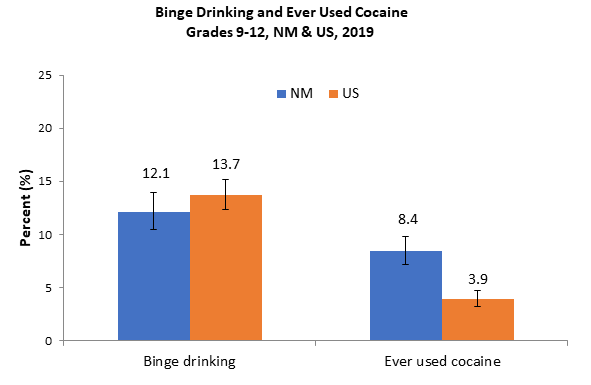

```{r setup, include=FALSE}
knitr::opts_chunk$set(cache = TRUE, echo=FALSE, warning=FALSE, cache.lazy = FALSE, cache.comments=FALSE)
```

```{r, echo=FALSE, message = FALSE, warning = FALSE, include=FALSE}
#options(kableExtra.latex.load_packages = FALSE)
library(ggplot2)
library(tidyverse)
library(haven)
library(readxl)
library(crosstable)
library(survey)
library(kableExtra)
library(expss)
library(labelled)
library(cowplot)
library(plyr)
library(dplyr)
library(magrittr)
library(scales)
library(ggpubr)

options(digits = 7)
# countystr <- paste0({params$counties}," County")


yrbss_NM <- read_dta("YRRS/County & District Reports/Datasets/nmHS2021YRRS_nm_v3_ed.dta")
#Survey designs

yrrs_cnty <- svydesign(id=~psu, strata=~strata, weights=~fwt_cnty, data=yrbss_NM)
options(survey.lonely.psu = "adjust")

yrrs_nm <- svydesign(id=~psu, strata=~strata, weights=~fwt_str, data=yrbss_NM)
options(survey.lonely.psu = "adjust")
options(survey.adjust.domain.lonely=TRUE)

#Stata includes PSUs in survey design from other counties but same strata values. Getting the degrees of freedom allows us to replicate Stata
#Get the strata values in county of interest
# strata_to_use <- unique(yrbss_NM$strata[(yrbss_NM$cntytxt=={params$counties})])
# #Get the number of PSUs contained in the strata
# number_of_PSUs <- length(unique(yrbss_NM$psu[(yrbss_NM$strata %in% strata_to_use)]))
# Design_df <- number_of_PSUs - length(strata_to_use)

#Importing data sets from previous years
#State level survey designs for district level analyses

year1 <- read_dta("YRRS/County & District Reports/Datasets/nmHS2011yrrs_NM_v2.dta")
#year1<-subset(year1, fwtlvl_cnty!="")
#yrrs_cnty_1 <- svydesign(id=~psu, strata=~stratum, weights=~fwtlvl_cnty, data=year1)
year1<-subset(year1, fwtlvl_str!="")
yrrs_nm_1 <- svydesign(id=~psu, strata=~stratum, weights=~fwtlvl_str, data=year1)

year2 <- read_dta("YRRS/County & District Reports/Datasets/nmHS2013YRRS_nm_v3.dta")
#year2<-subset(year2, fwt_cnty!="")
#yrrs_cnty_2 <- svydesign(id=~psu, strata=~strata, weights=~fwt_cnty, data=year2)
year2<-subset(year2, fwt_str!="")
yrrs_nm_2 <- svydesign(id=~psu, strata=~strata, weights=~fwt_str, data=year2)

year3 <- read_dta("YRRS/County & District Reports/Datasets/nmHS2015YRRS_nm_v6.dta")
#yrrs_cnty_3 <- svydesign(id=~psu, strata=~strata, weights=~fwt_cnty, data=year3)
yrrs_nm_3 <- svydesign(id=~psu, strata=~strata, weights=~fwt_str, data=year3)

year4 <- read_dta("YRRS/County & District Reports/Datasets/nmHS2017YRRS_nm_v6_dg.dta")
#yrrs_cnty_4 <- svydesign(id=~psu, strata=~strata, weights=~fwt_cnty, data=year4)
yrrs_nm_4 <- svydesign(id=~psu, strata=~strata, weights=~fwt_str, data=year4)

year5 <- read_dta("YRRS/County & District Reports/Datasets/nmHS2019YRRS_nm_v2_dg.dta")
#yrrs_cnty_5 <- svydesign(id=~psu, strata=~strata, weights=~fwt_cnty, data=year5)
yrrs_nm_5 <- svydesign(id=~psu, strata=~strata, weights=~fwt_str, data=year5)
options(survey.lonely.psu = "adjust")

#Changing variable names in old datasets to match newer ones
year1 <- year1 %>% dplyr::rename(
  #New name = old name
  sdid = sd,
  rodedui = rodedrnk,
  dui = drivedrnk,
  sexforce = forcesex,
  qntob5 = anytob,
  fiveaday = qnfrvg,
  qnsoda1 = soda,
  pe1 = pe
)

year2 <- year2 %>% dplyr::rename(
  #New name = old name
  sexforce = forcesex,
  qntob5 = anytob,
  syn30 = synmari,
  qnbk7day = bkft,
  fiveaday = qnfrvg,
  qnsoda1 = soda,
  nobk = qnnobkft
)
#Reconfigure study designs after making changes
yrrs_nm_1 <- svydesign(id=~psu, strata=~stratum, weights=~fwtlvl_str, data=year1)
yrrs_nm_2 <- svydesign(id=~psu, strata=~strata, weights=~fwt_str, data=year2)
#yrrs_cnty_1 <- svydesign(id=~psu, strata=~stratum, weights=~fwtlvl_cnty, data=year1)
#yrrs_cnty_2 <- svydesign(id=~psu, strata=~strata, weights=~fwt_cnty, data=year2)


# New Labels for some of our variables
yrbss_NM <- apply_labels(yrbss_NM,
                            nssi = "Non-suicidal self-injury",
                            sad = "Felt sad or hopeless",
                            consider = "Seriously considered suicide",
                            plan = "Made a suicide plan",
                            suiatt = "Attempted suicide",
                            suiinj = "Injured in a suicide attempt",
                            helmet = "Rarely or never wore a bicycle helmet",
                            seatbelt = "Rarely or never wore a seatbelt",
                            rodedui = "Rode with a drinking driver",
                            skipsafe = "Skipped school because of safety concerns",
                            fight = "In a physical fight",
                            dui = "Drinking and driving",
                            maridrv = "Marijuana use and driving",
                            text = "Texting and driving",
                            fightscl = "In a physical fight on school property",
                            weapscl = "Carried weapon on school property",
                            gun12m = "Carried a gun (not for sport or hunting)",
                            gunhome = "Gun in home",
                            hurtdate = "Physical dating violence",
                            sexviol = "Sexually assaulted (Forced to do sexual things)",
                            sexforce = "Ever forced to have sexual intercourse",
                            bully = "Bullied on school property",
                            cbully = "Electronically bullied",
                            racetease = "Teased because of race/ethnicity",
                            drnk10 = "High intensity binge drinking",
                            rxpain30 = "Improper pain medication use",
                            qndlype = "Daily PE in school",
                            y21screen3 = "Screen time three or more hours daily",
                            fiveaday = "Five servings of fruit or vegetables daily",
                            qnsoda1 = "Daily soda consumption",
                            sex4 = "Had sexual intercourse with four or more people",
                            homeless = "Unstable housing",
                            her30 = "Heroin",
                            coca30 = "Cocaine",
                            meth30 = "Methamphetamine",
                            inh30 = "Inhalants",
                            syn30 = "Synthetic marijuana",
                            mari30 = "Marijuana",
                            vapedly = "Daily e-cig use",
                            condom = "Used a condom at last sexual intercourse",
                            sexdrg = "Used alcohol or drugs before sexual intercourse", 
                            nocondom = "Did not use a condom at last sexual intercourse",
                            y21bcp = "Birth control pills", 
                            y21qnshparg = "Shot, Patch, or Birth Control Ring", 
                            y21bccondom = "Condoms",
                            y21bcwithd = "Withdrawal or some other method",
                            y21qnbcnone = "No birth control method",
                            nobk = "Did not eat breakfast in last 7 days",
                            concussion = "Had a sports-related concussion",
                            dental = "Saw a dentist in the last 12 months",
                            physdis = "Physical disabilities or long-term health problems",
                            hlfnoneng = "Spoke a non-English language at home at least half the time", 
                            liveoutus = "Ever lived outside the US",
                            unaccmin = "Kicked out or ran away in the last 30 days",
                            gamble = "Gambled at least once in the last 12 months",
                            sleep8 = "8 or more hours of sleep per night",
                            skipmo = "Skipped school at least once in the last 30 days", 
                            nvrskip = "Never skipped school in the last 30 days",
                            covmental = "Frequent mental distress", 
                            covlostjob = "Parent or adult in house lost their job",
                            covhungry = "Went hungry some of the time or more often", 
                            covschool = "School work was more difficult",
                            qnfrcig = "Smoked on 20 or more of the last 30 days",
                            cigar = "Cigar", 
                            hookah = "Hookah",
                            spittob = "Spit tobacco",
                            qntob5 = "Any tobacco use",
                            pedlths = "Less than high school",
                            pedhs = "Completed high school", 
                            pedcoll = "Completed college or professional school",
                            alcgave = "Someone Gave it to me",
                            r3phobby = "Outside of my home and school, I am involved in art, sports, or a hobby",
                            r3pconted = "I plan to go to college or some other school after high school",
                            r3fhelp = "I have a friend about my own age who helps me when I'm having a hard time",
                            r3fcare = "I have a friend about my own age who really cares about me",
                            r3cgroup = "Outside of my home and school, I am a part of group activities",
                            r3cgoodjob = "Outside of my home and school, there is an adult who tells me when I do a good job",
                            r3ccare = "Outside of my home and school, there is an adult who really cares about me",
                            r3sgroup = "At school I am involved in sports, clubs, or other extra-curricular activities ",
                            r3srule = "In my school, there are clear rules about what students can and cannot do",
                            r3ssuccess = "At my school, there is a teacher or some other adult who believes that I will be a success",
                            r3slisten = "At my school, there is a teacher or some other adult who listens to me",
                            r3hknow = "When I am not at home, one of my parents/guardians knows where I am and who I am with",
                            r3hsuccess = "In my home, a parent or some other adult believes that I will be a success",
                            r3hintscl = "In my home, a parent or some other adult is interested in my school work",
                            qn106 = "A parent or other adult is interested in my school work",
                            qn107 = "A parent or other adult believes I'll be a success",
                            qn114 = "A parent or guardian knows where I am and who I'm with when I'm not home",
                            qn108 = "A teacher or other adult listens to me", 
                            qn109 = "A teacher or other adult believes I'll be a success", 
                            qn115 = "There are clear rules for my behaviors", 
                            qn117 = "I am involved in extra-curricular activities",
                            qn110 = "There is an adult who really cares about me",
                            qn111 = "There is an adult who tells me when I do a good job", 
                            qn118 = "I am involved in group activities",
                            qn112 = "I have a friend who really cares about me", 
                            qn113 = "I have a friend who helps me when I'm having a hard time", 
                            qn116 = "I plan to go to college or other school after high school", 
                            qn119 = "I am involved in music, art, literature, sports, or a hobby")

#Defining lists of years for trend function
years <- c("2011", "2013", "2015", "2017", "2019", "2021")
#Survey designs at county level
#year_survey <- c("yrrs_cnty_1", "yrrs_cnty_2", "yrrs_cnty_3", "yrrs_cnty_4", "yrrs_cnty_5", "yrrs_cnty")
#Survey designs at state/district level for district reports
year_survey <- c("yrrs_nm_1", "yrrs_nm_2", "yrrs_nm_3", "yrrs_nm_4", "yrrs_nm_5", "yrrs_nm")
datasets <- list(year1, year2, year3, year4, year5, yrbss_NM)

#length(yrbss_NM$cntytxt[(yrbss_NM$cntytxt =={params$counties})])

```


```{r Importing_Functions}
source("Report Functions.R")
```


\newpage

## Suggested citation: {.unlisted .unnumbered}

New Mexico Youth Risk and Resiliency Survey: High School Survey Results 2021, `r {params$District_name}`. (2021). Epidemiology and Response Division, New Mexico Department of Health; School and Family Support Bureau, New Mexico Public Education Department;and University of New Mexico Prevention Research Center. https://youthrisk.org/publications/county-reports/.

&nbsp;    
&nbsp;    
&nbsp;  
This publication was produced by the New Mexico Department of Health (NM DOH), the Public Education Department (NM PED), and the University of New Mexico Prevention Research Center. The NM YRRS receives support from the Centers for Disease Control and Prevention in cooperation with the NM PED through Grant number 6NU87PS0043 14-05-01. For information about administration and methods used in implementation of the New Mexico Youth Risk and Resiliency Survey (NM YRRS), see [www.youthrisk.org](https://www.youthrisk.org).


\newpage

### ACKNOWLEDGEMENTS {.unlisted .unnumbered}
This report is a product of the NM Youth Risk and Resiliency Survey (YRRS), a project that characterizes risk behaviors and resiliency/protective factors among New Mexico youth. The YRRS is a joint project of the New Mexico Department of Health (NMDOH) the New Mexico Public Education Department (PED), and the University of New Mexico Prevention Research Center (UNM PRC), with support and technical assistance from the Office of Substance Abuse Prevention, Behavioral Health Services Division (OSAP-BHSD); the Albuquerque Area Southwest Tribal Epidemiology Center (AASTEC); and the U.S. Centers for Disease Control and Prevention, Division of Adolescent and School Health (CDC-DASH). Gratitude is extended to the individuals listed below for their contribution to developing and producing this report. (Individuals who served on the NM-YRRS 2019 Steering Committee are identified by an asterisk (*).)  

### NEW MEXICO DEPARTMENT OF HEALTH {.unlisted .unnumbered}
Patrick Allen, Cabinet Secretary  
Laura Parajon, MD, MPH, Deputy Secretary, State Epidemiologist and Acting Division Director, Emergency and Response Division  
Rachel Wexler, Acting Bureau Chief, Injury and Behavioral Epidemiology Bureau  
Dan Green, MPH, Survey Epidemiologist, Injury and Behavioral Epidemiology Bureau*  
Hayley Peterson, MPH, Drug Overdose Morbidity Epidemiologist, Injury and Behavioral Epidemiology Bureau*  
James Farmer, MPH, Director, Office of School and Adolescent Health*  
Dylan Pell, MPH, MSW, Mental Health Epidemiologist, Injury and Behavioral Epidemiology Bureau*  

### NEW MEXICO PUBLIC EDUCATION DEPARTMENT {.unlisted .unnumbered}
Kurt Steinhaus, Ed.D., Secretary of Education  
Anne Marlow-Geter, Director, Safe & Healthy Schools Bureau (interim)  

### ALBUQUERQUE AREA SOUTHWEST TRIBAL EPIDEMIOLOGY CENTER {.unlisted .unnumbered} 
Kevin English, DrPh, MPH, Director  
Carolyn Parshall, MPH, Epidemiologist*  
Cynthia Garcia, BS, CDC Public Health Associate*  

### NEW MEXICO HUMAN SERVICES DEPARTMENT, BEHAVIORAL HEALTH SERVICES DIVISION {.unlisted .unnumbered} 
Neal Bowen, PhD, Director, Behavioral Health Services Division  
Jacqueline Nielsen, Deputy Director, Behavioral Health Services Division  
Antonette Tone Silva-Jose, Prevention Operations Manager, Office of Substance Abuse Prevention  

The NM Department of Health receives support for the NM YRRS from the Centers for Disease Control
and Prevention in cooperation through Grant number 6NU87PS0043 14-05-01.

\newpage  
### 2021 YRRS Team at UNM Prevention Research Center {.unlisted .unnumbered}   
Shane Barton, Programmer Analyst   
Kelly Cockrell, Web Designer and Communications   
Edward Davis, Statistician   
Kevin Estes, PhD, Postdoctoral Fellow   
Courtney FitzGerald, MSSW, LMSW, MPH, Senior Research Scientist*     
Jeremy Gonzales, Professional Intern   
Alysandra Jackson, Professional Intern   
M. Rebecca Kilburn, PhD, Research Professor*     
Oscar Mendez-Cera, Associate Scientist   
Kelly Valdez, Professional Intern   
Robyn Viera, MA, Scientific Research Manager*                          
\newpage  
\tableofcontents


```{r echo=FALSE, warning=FALSE, message=FALSE}

yrbss_hs_district <- subset(yrbss_NM, sdid=={params$District})
#Response rates
#Number of students in current county who responded


Profiles <- c(" ", "Girls", "Boys", "American Indian or Alaska Native", "Asian", "Black or African-American", "Hispanic", "Native Hawaiian or Pacific Islander ", "White", "9th", "10th", "11th", "12th", "Other")

# Totals <- c(total_responses, girl_r, boy_r, AIAN_r, Asian_r, AA_r, Hisp_r, NHOPI_r, WH_r, nine_r, ten_r, eleven_r, twelve_r, other_r)
Totals <- c(length(yrbss_hs_district$sdid)
            #Girls/boys
            , length(na.omit(yrbss_hs_district$sex[(yrbss_hs_district$sex==1)]))
            , length(na.omit(yrbss_hs_district$sex[(yrbss_hs_district$sex==2)]))
            #Race/ethnicity
            , length(na.omit(yrbss_hs_district$ai[(yrbss_hs_district$ai==1)]))
            , length(na.omit(yrbss_hs_district$as[(yrbss_hs_district$as==1)]))
            , length(na.omit(yrbss_hs_district$aa[(yrbss_hs_district$aa==1)]))
            , length(na.omit(yrbss_hs_district$hisp[(yrbss_hs_district$hisp==1)]))
            , length(na.omit(yrbss_hs_district$pi[(yrbss_hs_district$pi==1)]))
            , length(na.omit(yrbss_hs_district$wh[(yrbss_hs_district$wh==1)]))
            #Grade level
            , length(na.omit(yrbss_hs_district$grade[(yrbss_hs_district$grade==1)]))
            , length(na.omit(yrbss_hs_district$grade[(yrbss_hs_district$grade==2)]))
            , length(na.omit(yrbss_hs_district$grade[(yrbss_hs_district$grade==3)]))
            , length(na.omit(yrbss_hs_district$grade[(yrbss_hs_district$grade==4)]))
            , length(yrbss_hs_district$grade[is_tagged_na(yrbss_hs_district$grade, "a")]))
Percents <- c(rep("a", length(Totals)))

for (i in 1:length(Totals)){
  Percents[i] <- percent(Totals[i]/Totals[1],accuracy = 0.1)
}
            

Participation_Rates <- data.frame(Profiles, Totals, Percents)
colnames(Participation_Rates)[1:3] <- c("Profile of students surveyed", "Number of students who responded", "Percent (%)")

Participation_table <- kbl(Participation_Rates, booktabs = T, align = c('l', 'r', 'r'), position = 'b') %>% pack_rows(index = c("Total" = 1, "Gender" = 2, "Race/Ethnicity" = 6, "Grade Level" = 5))
#kable_styling(Participation_table, position = "center", latex_options =  "basic")


```

\newpage  
\centering
### New Mexico Youth Risk and Resiliency Survey {.unlisted .unnumbered}  
### Participation in `r {params$District_name}`  
### High School (Grades 9-12) {.unlisted .unnumbered}  
\raggedright

The response rate for `r {params$District_name}` was `r signif(yrbss_NM$rr_sd[(yrbss_NM$sdid=={params$District})][1], 3)*100`%.  
A high response rate produces survey results that are more representative of the student population.  
A response rate of at least 60% allows generalization of results to the entire student body. A response 
rate of 70% is excellent and allows a high degree of confidence in results. Response rates below 60% 
are considered low, and caution should be exercised in interpreting results. Low response rates 
indicate that the data may represent only students who participated in the survey and not necessarily 
the entire student body


```{r echo=FALSE, warning=FALSE, message=FALSE}
Participation_table

```

\newpage  
\centering
### New Mexico Youth Risk and Resiliency Survey {.unlisted .unnumbered}  
# Risk Behaviors at a Glance  
### `r {params$District_name}` {.unlisted .unnumbered}  
### Grades 9-12 {.unlisted .unnumbered}
\raggedright
```{r, echo=FALSE, warning=FALSE, message=FALSE}
Table_function <- function(varlist) {
  
  Data_frame_values <- data.frame(matrix(ncol=9,nrow=length(varlist)))
  colnames(Data_frame_values) <- c("Indicator", "sds_Value", "sds_ci_l", "sds_ci_u", "sds_ci", "NM_Value", "NM_ci_l", "NM_ci_u", "NM_ci")
  ########################################################

  for(i in 1:length(varlist)){
    
    varname <- varlist[i]
    Data_frame_values[i,1] <- var_label(yrbss_NM[varname][[1]])
    
    #District level values
    Data_frame_values[i,2:4] <- round((svyby(as.formula( paste0("~", varname)), ~sdid=={params$District}, yrrs_nm, svyciprop, vartype ="ci",method="xlogit", multicore=TRUE, na.rm=T))[2,2:4] *100, 1)
    Data_frame_values[i,5] <- paste0("(",Data_frame_values[i,3], "-",Data_frame_values[i,4],")")
    
    #NM level values
    Data_frame_values[i,6] <- round((svymean(yrbss_NM[varname], yrrs_nm, multicore=TRUE, na.rm=T))[1] *100, 1)
    Data_frame_values[i,7:8] <- round((confint(svymean(yrbss_NM[varname], yrrs_nm, multicore=TRUE, na.rm=T)))[1:2] *100, 1)
    Data_frame_values[i,9] <- paste0("(",Data_frame_values[i,7], "-",Data_frame_values[i,8],")")
    
  }

  Data_frame_values$Indicator <- factor(Data_frame_values$Indicator, levels = var_label(yrbss_NM[varlist]))
  #Data_frame_values <- data.frame(Indicator, sds_Value, sds_ci, NM_Value, NM_ci)

  return(Data_frame_values)
}

table_bb <- Table_function(c("helmet", "seatbelt", "rodedui", "dui", "maridrv", "text",
                             "fight", "fightscl","weapscl", "gun12m", "skipsafe", "hurtdate", "sexviol","sexforce",
                             "bully", "cbully", "racetease",
                             "nssi", "sad", "mental", "consider", "plan", "suiatt", "suiinj",
                             "qntob5", "vape30", "cig30", "cigar", "spittob", "hookah"
                             ))
header_groups = c(1,2,2)
names(header_groups) = c(" ",{params$District_name}, "New Mexico")

kbl(table_bb[,c(1,2,5,6,9)], booktabs = T, align = NULL, position = 'b', row.names = FALSE, col.names = c("Indicator", "%", "(95% CI)", "%", "(95% CI)")) %>%
  #kable_styling(latex_options =  "striped") %>%
  add_header_above(header_groups) %>%
  pack_rows( index = c("Unintentional Injuries" = 6, "Violence" = 8, "Bullying" = 3, "Mental health"=7,
                       "Tobacco use" = 6))
```

\newpage
\centering
### New Mexico Youth Risk and Resiliency Survey {.unlisted .unnumbered}  
# Risk Behaviors at a Glance  {.unlisted .unnumbered} 
### `r {params$District_name}` {.unlisted .unnumbered}  
### Grades 9-12 {.unlisted .unnumbered}
\raggedright

```{r, echo=FALSE, warning=FALSE, message=FALSE, cache.rebuild=TRUE}
table_cc <- Table_function(c("drnk30", "binge54", "drnk10", "drnk13", "dui",
                             "mari30", "syn30", "rxpain30", "coca30", "her30", "meth30", "inh30",
                             "qnowt", "qnobese", "bodywt2", "qnpa7day", "qnpa0day", "qndlype", "y21screen3", "qnbk7day", "fiveaday", "qnsoda1",
                             "sexact", "sex4", "sex13", "condom", "y21rely", "y21qndualbc"))

kbl(table_cc[,c(1,2,5,6,9)], booktabs = T, align = NULL, position = 'b', row.names = FALSE, col.names = c("Indicator", "%", "(95% CI)", "%", "(95% CI)")) %>%
  #kable_styling(latex_options =  "striped") %>%
  add_header_above(header_groups) %>%
  pack_rows( index = c("Alcohol use" = 5, "Current drug use" = 7, "
Physical Activity, Body Weight, and Nutrition" = 10, "Sexual behavior" = 6))
```
\newpage

&nbsp;

\newpage


&nbsp;
&nbsp;

\centering

### New Mexico Youth Risk and Resiliency Survey (YRRS) {.unlisted .unnumbered}  
##  Highlights  
### `r {params$District_name}` {.unlisted .unnumbered}  
### Grades 9-12 {.unlisted .unnumbered}

\raggedright

\newpage

Highlights from the New Mexico Youth Risk and Resiliency Survey (YRRS)  
`r {params$District_name}`   
High School (Grades 9-12)
&nbsp;


\par
|   Statewide results from the 2021 High School NM YRRS revealed both encouraging and concerning trends in New Mexico. Rates of youth alcohol use, drug use and most tobacco use decreased over the past 10 years. Trends in rates of behaviors associated with violence were mixed, as the rates of physical fighting and carrying a weapon to school both decreased, while rates of sexual and dating violence remained largely unchanged. The rate of being bullied at school decreased, while the rate of electronic bullying showed little variation.  

|   Of serious concern were the increasing rates for obesity, suicidal behaviors, and characteristics associated with mental health.

|   The COVID-19 pandemic played a big part in the 2021 YRRS. When data were collected in the fall and winter of 2021, school were facing COVID-related closures and high rates of absenteeism, resulting in decreased YRRS participation at the student and school level. COVID may also have altered student behavior, as there were fewer opportunities for social interaction, and fewer opportunities to engage in socially-related high-risk behaviors. COVID also may have affected the emotional well-being of students. The 2021 YRRS included questions about the effect of COVID on students’ lives.

|   The rate of obesity or overweight, after increasing for several years, has not increased since 2015. Rates for most violence-related behaviors have not changed greatly. However, the rate of ever being physically forced to have sexual intercourse is higher in New Mexico than in the U.S.


|   This report puts the findings for New Mexico alongside YRRS results for `r {params$District_name}`. Thank you for using this information to make New Mexico and your own community a safer and healthier place for all young people. For more YRRS results, see www.youthrisk.org.

\newpage

##### Mental Health {.unlisted .unnumbered}

&nbsp;

|   Suicide is the second leading causes of death among adolescents in New Mexico. The NM rate of past-year suicide attempts has not changed substantially since 2011 (2011 = 9.8%; 2019 = 10.4%). The rate for suicide attempts resulting in injury has also been stable since 2011 (2011 = 3.7%; 2019 = 3.1%). The rate of sadness or hopelessness increased by 44% from 2011 – 2021 (30.8% to 44.2%), while over the same years, the rate of seriously considering a suicide attempt increased by 18% (17.1% to 20.1%) and the rate of making a suicide plan also increased by 18% (14.3% to 16.9%).

```{r, echo=FALSE, warning=FALSE, message=FALSE, fig.height = 4.5, fig.width=6.5}
barplot_district(c("suiinj", "suiatt","plan","consider", "mental", "sad","nssi"), "Past Year Mental Health Indicators" )
```

\newpage

##### Tobacco Use {.unlisted .unnumbered}

&nbsp;

|   For the first time since 2015, when a question about e-cigarette use (vaping) was first included in the survey, the NM rate of current e-cigarette use decreased, from 33.4% in 2019 to 25.3% in 2021. The NM rates of current use all other tobacco products decreased dramatically over the ten years from 2011-2021: Cigarettes (20.7% to 4.2%); cigars (15.8% to 3.1%); spit tobacco (9.5% to 2.9%); and hookah use to smoke tobacco (21.2% to 3.2%). The rate of any current tobacco use (past 30-day use of at least one of five tobacco products: e-cigarettes, cigarettes, cigars, hookah, or spit tobacco) decreased from 37.2% in 2019 to 27.3% in 2021, after climbing from 23.1% in 205 to 33.4% in 2019.

&nbsp;
&nbsp;

```{r, echo=FALSE, warning=FALSE, message=FALSE, fig.height = 5, fig.width=6.5}
print(barplot_district(c("spittob","cigar","hookah","cig30", "vape30","qntob5"), "Current Tobacco Use"))
```

\newpage

##### Alcohol Use {.unlisted .unnumbered}

&nbsp;

|   Alcohol use by young people is associated with injuries such as motor vehicle crashes, the leading cause of death among adolescents. Alcohol use at an early age is also associated with an increased risk of chronic liver disease and alcohol dependence later in life. In recent years, rates of current drinking, binge drinking, and drinking and driving have been decreasing among young people nationally and in New Mexico. In New Mexico, from 2011 to 2021, the rate of current alcohol use decreased by 95% (38.2% to 19.5%), binge drinking decreased by more than 200% (24.0% to 7.6%), drinking before the age of 13 decreased by 48% (26.4% to 17.8%), and drinking and driving decreased by 91% (8.8% - 4.6%).

&nbsp;
&nbsp;

```{r, echo=FALSE, warning=FALSE, message=FALSE, fig.height = 5, fig.width=6.5}
print(barplot_district(c("drnk30","binge54","drnk10","drnk13", "dui"), "Alcohol Use"))
```

\newpage

##### Drug Use {.unlisted .unnumbered}

&nbsp;

|   All rates of current drug use decreased from 2019 to 2021, after a long period of very little change for most substances. From 2019-2021, current marijuana use decreased by almost 30% (28.4% to 20.3%), current inhalant use decreased by 30% (5.0% to 3.4%), current cocaine use decreased by 50% (4.1% to 2.0%), current methamphetamine used decreased by 50% (2.8% to 1.4%), and current heroin use decreased by 60% (2.7% to 1.1%).

&nbsp;

```{r, echo=FALSE, warning=FALSE, message=FALSE, fig.height = 5, fig.width=6.5}
print(barplot_district(c("her30", "coca30", "meth30", "inh30", "syn30", "rxpain30", "mari30"), "Current Drug Use"))
```

\newpage

##### Sexual Behavior {.unlisted .unnumbered}

&nbsp;

|   Early and unsafe sexual activity puts teens at risk of unplanned pregnancy and sexually transmitted infections. The NM rate of being sexually active decreased from 32.3% in 2011 to 19.9% in 2021, and the rate of have sexual intercourse before age 13 decreased from 7.9% to 4.2%. Among sexually active students, the rate of condom use decreased from 58.2% to 49.3%, the rate of using a reliable form of birth control increased from 21.8% to 29.7%, and the rate of using both reliable birth control and a condom did not vary greatly from 2011 (7.5%) to 2021 (8.8%).


```{r, echo=FALSE, warning=FALSE, message=FALSE, fig.height = 4, fig.width=6.5}
print(barplot_district(c("sex13","sex4","sexact"), "Sexual Behavior"))
print(barplot_district(c("condom","y21rely","y21qndualbc"), "Sexual Behavior among Sexually Active Students")+ scale_x_continuous(labels = scales::percent_format(scale = 100), limits = c(0,1), breaks = seq(0, 1, .25)))
```


\newpage

##### Physical Activity, Body Weight, and Nutrition {.unlisted .unnumbered}

&nbsp;

|   Poor nutritional behaviors and a lack of physical activity put young people at risk of becoming overweight or obese. Obese and overweight teens are at risk for many chronic diseases that can cause death or disability. The rate of obesity increased by 40% from 2011 to 2021 (13.4% to 19.9%), with most of that increase occurring from in 2019 to 2021 (15.7% to 19.9%). The rate of overweight increased by 30% from 2011 to 2021 (13.6% to 17.7%).

```{r, echo=FALSE, warning=FALSE, message=FALSE, fig.height = 4, fig.width=6.5}
print(barplot_district(c("bodywt2","qnobese","qnowt"), "Obesity and Overweight"))
print(barplot_district(c("qnsoda1","fiveaday","qnbk7day"), "Nutrition"))
print(barplot_district(c("y21screen3", "qndlype","qnpa7day","qnpa0day"), "Physical Activity"))
```

\newpage

##### Injury: Behaviors associated with Violence {.unlisted .unnumbered}

&nbsp;

|   From 2011 to 2021, the NM rate for physical fighting decreased by 39% (33.1% to 20.2%), the rate of carrying a weapon (gun, knife, or club) on school property decreased by 27% (6.3% to 4.6%). Rates of sexual and dating violence remained largely unchanged. The rate of skipping school because of safety reasons almost doubled (7.5% to 14.9%). The rate of being bullied at school decreased by 26% (18.5% to 13.6%), while the rate of electronic bullying showed little variation (12.5% in 2021).

```{r, echo=FALSE, warning=FALSE, message=FALSE, fig.height = 6, fig.width=6.5}
print(barplot_district(c("sexforce","sexviol","hurtdate", "skipsafe", "gun12m", "weapscl", "fightscl", "fight"), "Behaviors Associated with Violence"))
```
\newpage

##### COVID-19 Pandemic

&nbsp;

|   The COVID-19 pandemic had a big impact on the lives of young people. The YRRS included questions about food security, frequent mental distress, family job security, and the difficulty of completing schoolwork during the pandemic.

```{r, echo=FALSE, warning=FALSE, message=FALSE, fig.height = 6, fig.width=6.5, fig.align = "center"}
print(barplot_district(c("covmental","covlostjob","covhungry", "covschool"), "COVID-19 Pandemic"))
```

\newpage
&nbsp;
&nbsp;

\centering

## `r {params$District_name}` {.unlisted .unnumbered} 
## Charts

\raggedright

\newpage
### Unintentional Injury
```{r, echo=FALSE, warning=FALSE, message=FALSE, fig.height = 4.5, fig.width=6.5}
# Unintentional_injury_1 <- trendplot(c("helmet", "seatbelt"), graph_subtitle = "Behaviors Associated with Unintentional Injury", grouped = TRUE)
# 
# Unintentional_injury_2 <- trendplot(c("rodedui", "dui", "text"), graph_subtitle = "Behaviors Associated with Unintentional Injury", grouped = TRUE)
# 
# ggpubr::ggarrange(Unintentional_injury_1, Unintentional_injury_2, ncol = 1, align = "v")

trendplot(c("helmet", "seatbelt"), graph_subtitle = "Behaviors Associated with Unintentional Injury", district_level=TRUE)
trendplot(c("rodedui", "dui", "text"), graph_subtitle = "Behaviors Associated with Unintentional Injury", district_level=TRUE)


```

\newpage

```{r, echo=FALSE, warning=FALSE, message=FALSE, fig.height = 17, fig.width=12, fig.align = "center"}
barplot_group(c("helmet", "seatbelt", "rodedui"), "Unintentional Injury", level="district")
```

\newpage

```{r, echo=FALSE, warning=FALSE, message=FALSE, fig.height = 17, fig.width=12, fig.align = "center"}
barplot_group(c("dui", "maridrv", "text"), "Unintentional Injury", level="district")
```

\newpage

```{r, echo=FALSE, warning=FALSE, message=FALSE, fig.height = 17, fig.width=12, fig.align = "center"}
barplot_group(c("gunhome", "gun12m"), "Unintentional Injury", level="district")
```

\newpage
### Injury: Behaviors Associated with Violence
```{r, echo=FALSE, warning=FALSE, message=FALSE, fig.height = 6, fig.width=7, fig.align = "center"}
trendplot(c("skipsafe", "weapscl", "fightscl", "fight"), graph_subtitle = "Behaviors Associated with Violence", district_level=TRUE)
```

\newpage

```{r, echo=FALSE, warning=FALSE, message=FALSE, fig.height = 17, fig.width=12, fig.align = "center"}
barplot_group(c("skipsafe", "weapscl", "fightscl", "fight"), "Injury: Behaviors Associated with Violence", level="district")
```

### Injury: Sexual and Intimate Partner Violence
```{r echo=FALSE, fig.align="center", fig.height=6, fig.width=7.5, message=FALSE, warning=FALSE}
trendplot(c("hurtdate", "sexviol", "sexforce"), graph_subtitle = "Injury: Sexual and Intimate Partner Violence", district_level=TRUE)
```
\newpage
```{r, echo=FALSE, warning=FALSE, message=FALSE, fig.height = 17, fig.width=12, fig.align = "center"}
barplot_group(c("sexforce", "sexviol", "hurtdate"), "Injury: Sexual and Intimate Partner Violence", level="district")
```

\newpage
### Injury: Bullying and Racial Discrimination
```{r, echo=FALSE, warning=FALSE, message=FALSE, fig.height = 6, fig.width=7, fig.align = "center"}
trendplot(c("bully", "cbully", "weapscl", "skipsafe"), graph_subtitle = "Injury: Bullying and School Violence", district_level=TRUE)
```

\newpage

```{r, echo=FALSE, warning=FALSE, message=FALSE, fig.height = 17, fig.width=12, fig.align = "center"}
barplot_group(c("weapscl", "bully", "cbully", "racetease"), "Injury: Bullying and Racial Discrimination", level="district")
```

\newpage
### Mental Health
```{r, echo=FALSE, warning=FALSE, message=FALSE, fig.height = 6, fig.width=7, fig.align = "center"}
trendplot(c("sad", "nssi", "consider", "plan", "suiatt", "suiinj"), graph_subtitle = "Mental Health", district_level=TRUE)
```

\newpage

```{r, echo=FALSE, warning=FALSE, message=FALSE, fig.height = 17, fig.width=12, fig.align = "center"}
barplot_group(c("nssi", "sad", "mental"), "Mental Health", level="district")
```

\newpage

```{r, echo=FALSE, warning=FALSE, message=FALSE, fig.height = 17, fig.width=12, fig.align = "center"}
barplot_group(c("consider", "plan", "suiatt", "suiinj"), "Mental Health: Suicidal behaviors", level="district")
```

\newpage
### Tobacco Use
```{r, echo=FALSE, warning=FALSE, message=FALSE, fig.height = 6, fig.width=7, fig.align = "center"}
trendplot(c("qntob5", "vape30", "hookah", "cig30", "cigar", "spittob"), graph_subtitle = "Current Tobacco Use", district_level=TRUE)
```

\newpage

```{r, echo=FALSE, warning=FALSE, message=FALSE, fig.height = 17, fig.width=12, fig.align = "center"}
barplot_group(c("cigevr", "cig113", "cig30", "qnfrcig"), "Tobacco: Cigarette Use", level="district")
```

\newpage

```{r, echo=FALSE, warning=FALSE, message=FALSE, fig.height = 17, fig.width=12, fig.align = "center"}
barplot_group(c("vapeevr", "vape30", "vapedly"), "Tobacco: E-cigarettes / Electronic Vapor Products", level="district")
```

\newpage

```{r, echo=FALSE, warning=FALSE, message=FALSE, fig.height = 17, fig.width=12, fig.align = "center"}
barplot_group(c("cigar", "hookah", "spittob", "qntob5"), "Other Current Tobacco Use", level="district")
```

\newpage
### Alcohol Use
```{r, echo=FALSE, warning=FALSE, message=FALSE, fig.height = 4, fig.width=6.5, fig.align = "center"}
trendplot(c("drnk30", "binge54", "drnk13", "drnk10"), graph_subtitle = "Alcohol Use", district_level=TRUE)
trendplot(c("rodedui", "dui"), graph_subtitle = "Alcohol Use", district_level=TRUE)
```

\newpage

```{r, echo=FALSE, warning=FALSE, message=FALSE, fig.height = 17, fig.width=12, fig.align = "center"}
barplot_group(c("drnkevr", "drnk13", "drnk30", "binge54", "drnk10"), "Alcohol Use", level="district")
```

\newpage

```{r, echo=FALSE, warning=FALSE, message=FALSE, fig.height = 17, fig.width=12, fig.align = "center"}
barplot_group(c("alcbought", "alcgave", "alcmoney", "alctook"), "Behaviors of current drinkers: How Usually Got Alcohol", level="district")
```

\newpage

```{r, echo=FALSE, warning=FALSE, message=FALSE, fig.height = 17, fig.width=12, fig.align = "center"}
barplot_group(c("alcmyhome", "alcotrhome", "alcvehicle", "alcschool", "alcpub"), "Behaviors of current drinkers: Where Usually Drank Alcohol", level="district")
```

\newpage

```{r, echo=FALSE, warning=FALSE, message=FALSE, fig.height = 17, fig.width=12, fig.align = "center"}
barplot_group(c("rodedui", "dui"), "Alcohol Use and Injury", level="district")
```

\newpage
### Drug Use
```{r, echo=FALSE, warning=FALSE, message=FALSE, fig.height = 4, fig.width=6.5, fig.align = "center"}
trendplot(c("mari30", "rxpain30", "syn30", "inh30"), graph_subtitle = "Current drug Use", district_level=TRUE)
trendplot(c("coca30", "meth30", "her30"), graph_subtitle = "Current drug Use", district_level=TRUE)
```

\newpage

```{r, echo=FALSE, warning=FALSE, message=FALSE, fig.height = 17, fig.width=12, fig.align = "center"}
barplot_group(c("marievr", "mari30", "marihvy", "mari13"), "Drug Use: Marijuana", level="district")
```

\newpage

```{r, echo=FALSE, warning=FALSE, message=FALSE, fig.height = 17, fig.width=12, fig.align = "center"}
barplot_group(c("syn30", "rxpain30", "coca30", "her30", "meth30", "inh30"), "Current (past 30 day) Drug Use", level="district")
```

\newpage

```{r, echo=FALSE, warning=FALSE, message=FALSE, fig.height = 17, fig.width=12, fig.align = "center"}
barplot_group(c("rxpainevr", "cocaevr", "ecsevr", "methevr", "herevr", "injevr"), "Lifetime Drug Use (ever used in lifetime)", level="district")
```

\newpage

```{r, echo=FALSE, warning=FALSE, message=FALSE, fig.height = 17, fig.width=12, fig.align = "center"}
barplot_group(c("drgscl"), "Access to Drugs", level="district")
```

\newpage
### Sexual Behavior
```{r, echo=FALSE, warning=FALSE, message=FALSE, fig.height = 6, fig.width=7, fig.align = "center"}
trendplot(c("condom", "sexevr", "sexact", "sex13"), graph_subtitle = "Sexual Behavior", district_level=TRUE)
```

\newpage

```{r, echo=FALSE, warning=FALSE, message=FALSE, fig.height = 17, fig.width=12, fig.align = "center"}
barplot_group(c("sexevr", "sexact", "sex13", "sex4"), "Sexual Behavior", level="district")
```

\newpage

```{r, echo=FALSE, warning=FALSE, message=FALSE, fig.height = 17, fig.width=12, fig.align = "center"}
barplot_group(c("sexdrg", "condom", "nocondom"), "Sexual Behaviors of Sexually Active Students", level="district")
```

\newpage

```{r, echo=FALSE, warning=FALSE, message=FALSE, fig.height = 17, fig.width=12, fig.align = "center"}
barplot_group(c("y21bcp", "y21qniudimp", "y21qnshparg", "y21bccondom", "y21bcwithd", "y21qnbcnone"), "Birth Control Methods used by Sexually Active Students", level="district")
```

\newpage

```{r, echo=FALSE, warning=FALSE, message=FALSE, fig.height = 17, fig.width=12, fig.align = "center"}
barplot_group(c("y21rely", "y21qndualbc"), "Birth Control Methods used by Sexually Active Students", level="district")
```

\newpage

```{r, echo=FALSE, warning=FALSE, message=FALSE, fig.height = 17, fig.width=12, fig.align = "center"}
barplot_group(c("opponly", "sameonly", "bothsex"), "Sex of Sexual Contacts", level="district")
```

\newpage
### Nutrition
```{r, echo=FALSE, warning=FALSE, message=FALSE, fig.height = 6, fig.width=7, fig.align = "center"}
trendplot(c("qnbk7day", "fiveaday", "qnsoda1", "nobk"), graph_subtitle = "Nutrition Indicators", district_level=TRUE)
```

\newpage

```{r, echo=FALSE, warning=FALSE, message=FALSE, fig.height = 17, fig.width=12, fig.align = "center"}
barplot_group(c("fiveaday", "qnfr0", "qnveg0"), "Nutrition", level="district")
```

\newpage

```{r, echo=FALSE, warning=FALSE, message=FALSE, fig.height = 17, fig.width=12, fig.align = "center"}
barplot_group(c("qnsoda1", "nobk", "qnbk7day"), "Nutrition", level="district")
```

\newpage

```{r, echo=FALSE, warning=FALSE, message=FALSE, fig.height = 17, fig.width=12, fig.align = "center"}
barplot_group(c("hungry", "hungrare"), "Nutrition", level="district")
```

\newpage
### Physical Activity
```{r, echo=FALSE, warning=FALSE, message=FALSE, fig.height = 6, fig.width=7, fig.align = "center"}
trendplot(c("qnpa7day", "pe1", "qndlype"), graph_subtitle = "Physical Activity Indicators", district_level=TRUE)
```

\newpage

```{r, echo=FALSE, warning=FALSE, message=FALSE, fig.height = 17, fig.width=12, fig.align = "center"}
barplot_group(c("qnpa0day", "qnpa7day", "y21screen3"), "Physical Activity", level="district")
```

\newpage

```{r, echo=FALSE, warning=FALSE, message=FALSE, fig.height = 17, fig.width=12, fig.align = "center"}
barplot_group(c("pe0", "qndlype", "concussion"), "Physical Activity", level="district")
```


\newpage
### Body Weight
```{r, echo=FALSE, warning=FALSE, message=FALSE, fig.height = 6, fig.width=7, fig.align = "center"}
trendplot(c("bodywt2", "qnobese", "qnowt"), graph_subtitle = "Obesity and Overweight", district_level=TRUE)
```

\newpage

```{r, echo=FALSE, warning=FALSE, message=FALSE, fig.height = 17, fig.width=12, fig.align = "center"}
barplot_group(c("bodywt2", "qnobese", "qnowt"), "Obesity and Overweight", level="district")
```

### Sexual Identity
```{r, echo=FALSE, warning=FALSE, message=FALSE, fig.height = 17, fig.width=12, fig.align = "center"}
barplot_group(c("straight", "lgb", "questioning"), "Sexual Identity", level="district")
```

### Gender Identity
```{r, echo=FALSE, warning=FALSE, message=FALSE, fig.height = 17, fig.width=12, fig.align = "center"}
barplot_group(c("gendernc", "genderns", "gendercis"), "Gender Identity", level="district")
```

### Other Behaviors and Characteristics
```{r, echo=FALSE, warning=FALSE, message=FALSE, fig.height = 17, fig.width=12, fig.align = "center"}
barplot_group(c("hiv", "dental"), "Other Behaviors and Characteristics: HIV test and dental visits", level="district")
```

\newpage

```{r, echo=FALSE, warning=FALSE, message=FALSE, fig.height = 17, fig.width=12, fig.align = "center"}
barplot_group(c("asthmaev", "asthmac", "physdis"), "Other Behaviors and Characteristics:\n Asthma, Physical Disabilities and Long-term Health Problems", level="district")
```

\newpage

```{r, echo=FALSE, warning=FALSE, message=FALSE, fig.height = 17, fig.width=12, fig.align = "center"}
barplot_group(c("pedlths", "pedhs", "pedcoll"), "Other Behaviors and Characteristics: Parents' Education", level="district")
```

\newpage

```{r, echo=FALSE, warning=FALSE, message=FALSE, fig.height = 17, fig.width=12, fig.align = "center"}
barplot_group(c("hlfnoneng", "liveoutus", "uslive"), "Other Behaviors and Characteristics", level="district")
```

\newpage

```{r, echo=FALSE, warning=FALSE, message=FALSE, fig.height = 17, fig.width=12, fig.align = "center"}
barplot_group(c("homeless", "unaccmin", "gamble", "gamblefr", "sleep8"), "Other Behaviors and Characteristics", level="district")
```

\newpage

```{r, echo=FALSE, warning=FALSE, message=FALSE, fig.height = 17, fig.width=12, fig.align = "center"}
barplot_group(c("gr_ab", "gr_df", "skipmo", "nvrskip"), "Other Behaviors and Characteristics: School Grades and Attendance", level="district")
```

\newpage
### COVID-19 Pandemic
```{r, echo=FALSE, warning=FALSE, message=FALSE, fig.height = 17, fig.width=12, fig.align = "center"}
barplot_group(c("covmental", "covlostjob", "covhungry", "covschool"), "Student characteristics during the COVID-19 Pandemic", level="district")
```

\newpage


&nbsp;
&nbsp;
&nbsp;
&nbsp;

\centering

# Resiliency/Protective Factors

\raggedright

\newpage
```{r, echo=FALSE, warning=FALSE, message=FALSE, fig.height = 4, fig.width=6, fig.align = "center"}
barplot_district_2(c("qn106", "qn107", "qn114"), "Resiliency/Protective Factors in the Home") + guides(x.sec = guide_none(title = "It is ''Very much true'' or ''Pretty much true'' that in my home..."))


barplot_district_2(c("qn108", "qn109", "qn115", "qn117"), "Resiliency/Protective Factors in the School") + guides(x.sec = guide_none(title = "It is ''Very much true'' or ''Pretty much true'' that in my school..."))

```

\newpage
```{r, echo=FALSE, warning=FALSE, message=FALSE, fig.height = 4, fig.width=6, fig.align = "center"}
barplot_district_2(c("qn110", "qn111", "qn118"), "Resiliency/Protective Factors in the Community")  + guides(x.sec = guide_none(title = "It is ''Very much true'' or ''Pretty much true'' that outside my home and school..."))

barplot_district_2(c("qn112", "qn113", "qn116", "qn119"), "Resiliency/Protective Factors with Peers and Personal") + guides(x.sec = guide_none(title = "It is ''Very much true'' or ''Pretty much true'' that..."))
```

\newpage

&nbsp;

\newpage

&nbsp;
&nbsp;

\centering

# Relationship Between Selected Risk Behaviors and Resiliency/Protective Factors

\raggedright

\newpage

```{r echo=FALSE, fig.height=13, fig.width=12, message=FALSE, warning=FALSE}
barplot_resiliency("fight", c("r3phobby","r3pconted", "r3fhelp", "r3fcare", "r3cgroup", "r3cgoodjob", "r3ccare", "r3sgroup", "r3srule", "r3ssuccess", "r3slisten", "r3hknow", "r3hsuccess", "r3hintscl"), "region")

#risk_props
```

#### How to read this chart: {.unlisted .unnumbered}
 * Of those who said it was 'Not true at all' that a parent or other adult was interested in their school work, `r risk_props[1]`% skipped school because of safety concerns.
 * Of those who said it was 'A little but or pretty much true' that a parent or other adult was interested in their school work, `r risk_props[2]`% skipped school because of safety concerns.
 * Of those who said it was 'Very much true' that a parent or other adult was interested in their school work, `r risk_props[3]`% skipped school because of safety concerns.

\newpage

```{r echo=FALSE, fig.align="center", fig.height=13, fig.width=12, message=FALSE, warning=FALSE, cache.rebuild=TRUE}
barplot_resiliency("skipsafe", c("r3phobby","r3pconted", "r3fhelp", "r3fcare", "r3cgroup", "r3cgoodjob", "r3ccare", "r3sgroup", "r3srule", "r3ssuccess", "r3slisten", "r3hknow", "r3hsuccess", "r3hintscl"), "region")
```
#### How to read this chart: {.unlisted .unnumbered}
 * Of those who said it was 'Not true at all' that a parent or other adult was interested in their school work, `r risk_props[1]`% skipped school because of safety concerns.
 * Of those who said it was 'A little but or pretty much true' that a parent or other adult was interested in their school work, `r risk_props[2]`% skipped school because of safety concerns.
 * Of those who said it was 'Very much true' that a parent or other adult was interested in their school work, `r risk_props[3]`% skipped school because of safety concerns.
 
\newpage

```{r, echo=FALSE, warning=FALSE, message=FALSE, fig.height = 13, fig.width=12, fig.align = "center", cache.rebuild=TRUE}
barplot_resiliency("bully", c("r3phobby","r3pconted", "r3fhelp", "r3fcare", "r3cgroup", "r3cgoodjob", "r3ccare", "r3sgroup", "r3srule", "r3ssuccess", "r3slisten", "r3hknow", "r3hsuccess", "r3hintscl"), "region")
```
#### How to read this chart: {.unlisted .unnumbered}
 * Of those who said it was 'Not true at all' that a parent or other adult was interested in their school work, `r risk_props[1]`% were bullied at school.
 * Of those who said it was 'A little but or pretty much true' that a parent or other adult was interested in their school work, `r risk_props[2]`% were bullied at school.
 * Of those who said it was 'Very much true' that a parent or other adult was interested in their school work, `r risk_props[3]`% were bullied at school.
 
\newpage

```{r, echo=FALSE, warning=FALSE, message=FALSE, fig.height = 13, fig.width=12, fig.align = "center", cache.rebuild=TRUE}
barplot_resiliency("sad", c("r3phobby","r3pconted", "r3fhelp", "r3fcare", "r3cgroup", "r3cgoodjob", "r3ccare", "r3sgroup", "r3srule", "r3ssuccess", "r3slisten", "r3hknow", "r3hsuccess", "r3hintscl"), "region")
```
#### How to read this chart: {.unlisted .unnumbered}
 * Of those who said it was 'Not true at all' that a parent or other adult was interested in their school work, `r risk_props[1]`% felt sadness or hopelessness.
 * Of those who said it was 'A little but or pretty much true' that a parent or other adult was interested in their school work, `r risk_props[2]`% felt sadness or hopelessness.
 * Of those who said it was 'Very much true' that a parent or other adult was interested in their school work, `r risk_props[3]`% felt sadness or hopelessness.
 
\newpage

```{r, echo=FALSE, warning=FALSE, message=FALSE, fig.height = 13, fig.width=12, fig.align = "center", cache.rebuild=TRUE}
barplot_resiliency("suiatt", c("r3phobby","r3pconted", "r3fhelp", "r3fcare", "r3cgroup", "r3cgoodjob", "r3ccare", "r3sgroup", "r3srule", "r3ssuccess", "r3slisten", "r3hknow", "r3hsuccess", "r3hintscl"), "region")
```
#### How to read this chart: {.unlisted .unnumbered}
 * Of those who said it was 'Not true at all' that a parent or other adult was interested in their school work, `r risk_props[1]`% attempted suicide.
 * Of those who said it was 'A little but or pretty much true' that a parent or other adult was interested in their school work, `r risk_props[2]`% attempted suicide.
 * Of those who said it was 'Very much true' that a parent or other adult was interested in their school work, `r risk_props[3]`% attempted suicide.
 
\newpage

```{r, echo=FALSE, warning=FALSE, message=FALSE, fig.height = 13, fig.width=12, fig.align = "center", cache.rebuild=TRUE}
barplot_resiliency("vape30", c("r3phobby","r3pconted", "r3fhelp", "r3fcare", "r3cgroup", "r3cgoodjob", "r3ccare", "r3sgroup", "r3srule", "r3ssuccess", "r3slisten", "r3hknow", "r3hsuccess", "r3hintscl"), "region")
```
#### How to read this chart: {.unlisted .unnumbered}
 * Of those who said it was 'Not true at all' that a parent or other adult was interested in their school work, `r risk_props[1]`% were current users of e-cigarettes/vapor products.
 * Of those who said it was 'A little but or pretty much true' that a parent or other adult was interested in their school work, `r risk_props[2]`% were current users of e-cigarettes/vapor products.
 * Of those who said it was 'Very much true' that a parent or other adult was interested in their school work, `r risk_props[3]`% were current users of e-cigarettes/vapor products.
 
\newpage

```{r, echo=FALSE, warning=FALSE, message=FALSE, fig.height = 13, fig.width=12, fig.align = "center", cache.rebuild=TRUE}
barplot_resiliency("binge54", c("r3phobby","r3pconted", "r3fhelp", "r3fcare", "r3cgroup", "r3cgoodjob", "r3ccare", "r3sgroup", "r3srule", "r3ssuccess", "r3slisten", "r3hknow", "r3hsuccess", "r3hintscl"), "region")
```
#### How to read this chart: {.unlisted .unnumbered}
 * Of those who said it was 'Not true at all' that a parent or other adult was interested in their school work, `r risk_props[1]`% were binge drinkers.
 * Of those who said it was 'A little but or pretty much true' that a parent or other adult was interested in their school work, `r risk_props[2]`% were binge drinkers.
 * Of those who said it was 'Very much true' that a parent or other adult was interested in their school work, `r risk_props[3]`% were binge drinkers.
 
\newpage

```{r, echo=FALSE, warning=FALSE, message=FALSE, fig.height = 13, fig.width=12, fig.align = "center", cache.rebuild=TRUE}
barplot_resiliency("dui", c("r3phobby","r3pconted", "r3fhelp", "r3fcare", "r3cgroup", "r3cgoodjob", "r3ccare", "r3sgroup", "r3srule", "r3ssuccess", "r3slisten", "r3hknow", "r3hsuccess", "r3hintscl"), "region")
```
#### How to read this chart: {.unlisted .unnumbered}
 * Of those who said it was 'Not true at all' that a parent or other adult was interested in their school work, `r risk_props[1]`% drove when they had been drinking.
 * Of those who said it was 'A little but or pretty much true' that a parent or other adult was interested in their school work, `r risk_props[2]`% drove when they had been drinking.
 * Of those who said it was 'Very much true' that a parent or other adult was interested in their school work, `r risk_props[3]`% drove when they had been drinking.
 
\newpage

```{r, echo=FALSE, warning=FALSE, message=FALSE, fig.height = 13, fig.width=12, fig.align = "center", cache.rebuild=TRUE}
barplot_resiliency("rxpain30", c("r3phobby","r3pconted", "r3fhelp", "r3fcare", "r3cgroup", "r3cgoodjob", "r3ccare", "r3sgroup", "r3srule", "r3ssuccess", "r3slisten", "r3hknow", "r3hsuccess", "r3hintscl"), "region")
```
#### How to read this chart: {.unlisted .unnumbered}
 * Of those who said it was 'Not true at all' that a parent or other adult was interested in their school work, `r risk_props[1]`% used painkillers to get high.
 * Of those who said it was 'A little but or pretty much true' that a parent or other adult was interested in their school work, `r risk_props[2]`% used painkillers to get high.
 * Of those who said it was 'Very much true' that a parent or other adult was interested in their school work, `r risk_props[3]`% used painkillers to get high.
 
\newpage

```{r, echo=FALSE, warning=FALSE, message=FALSE, fig.height = 13, fig.width=12, fig.align = "center", cache.rebuild=TRUE}
barplot_resiliency("sexact", c("r3phobby","r3pconted", "r3fhelp", "r3fcare", "r3cgroup", "r3cgoodjob", "r3ccare", "r3sgroup", "r3srule", "r3ssuccess", "r3slisten", "r3hknow", "r3hsuccess", "r3hintscl"), "region")
```
#### How to read this chart: {.unlisted .unnumbered}
 * Of those who said it was 'Not true at all' that a parent or other adult was interested in their school work, `r risk_props[1]`% were sexually active.
 * Of those who said it was 'A little but or pretty much true' that a parent or other adult was interested in their school work, `r risk_props[2]`% were sexually active.
 * Of those who said it was 'Very much true' that a parent or other adult was interested in their school work, `r risk_props[3]`% were sexually active.
 
\newpage

```{r, echo=FALSE, warning=FALSE, message=FALSE, fig.height = 13, fig.width=12, fig.align = "center", cache.rebuild=TRUE}
barplot_resiliency("bodywt2", c("r3phobby","r3pconted", "r3fhelp", "r3fcare", "r3cgroup", "r3cgoodjob", "r3ccare", "r3sgroup", "r3srule", "r3ssuccess", "r3slisten", "r3hknow", "r3hsuccess", "r3hintscl"), "region")
```
#### How to read this chart: {.unlisted .unnumbered}
 * Of those who said it was 'Not true at all' that a parent or other adult was interested in their school work, `r risk_props[1]`% were overweight or obese.
 * Of those who said it was 'A little but or pretty much true' that a parent or other adult was interested in their school work, `r risk_props[2]`% were overweight or obese.
 * Of those who said it was 'Very much true' that a parent or other adult was interested in their school work, `r risk_props[3]`% were overweight or obese.
 
\newpage

```{r, echo=FALSE, warning=FALSE, message=FALSE, fig.height = 13, fig.width=12, fig.align = "center", cache.rebuild=TRUE}
barplot_resiliency("homeless", c("r3phobby","r3pconted", "r3fhelp", "r3fcare", "r3cgroup", "r3cgoodjob", "r3ccare", "r3sgroup", "r3srule", "r3ssuccess", "r3slisten", "r3hknow", "r3hsuccess", "r3hintscl"), "region")
```
#### How to read this chart: {.unlisted .unnumbered}
 * Of those who said it was 'Not true at all' that a parent or other adult was interested in their school work, `r risk_props[1]`% had unstable housing.
 * Of those who said it was 'A little but or pretty much true' that a parent or other adult was interested in their school work, `r risk_props[2]`% had unstable housing.
 * Of those who said it was 'Very much true' that a parent or other adult was interested in their school work, `r risk_props[3]`% had unstable housing.
 
\newpage


&nbsp;
&nbsp;
&nbsp;
&nbsp;

\centering

# Appendix A: Questionnaire with Results


\newpage

```{r echo=FALSE, warning=FALSE, message=FALSE}
#yrbss_hs_district <- subset(yrrs2019, cntytxt=={params$counties})
Questionnaire <- read_excel("Questionnaires_HS-MS_2021.xlsx", 
    sheet = "HighSchool_2021_Questionnaire")

Personal_Info_Questions <- (Questionnaire$`NM 2021 HS YRRS Text`[(Questionnaire$`Row Type`=="Response")])[1:21]
#sum(yrbss_hs_district$v1[yrbss_hs_district$v1==2], na.rm=TRUE) #Get number of responses with answer


Totals <- c(#How old are you?
            length(na.omit(yrbss_hs_district$v1[yrbss_hs_district$v1==1])),
            length(na.omit(yrbss_hs_district$v1[yrbss_hs_district$v1==2])),
            length(na.omit(yrbss_hs_district$v1[yrbss_hs_district$v1==3])),
            length(na.omit(yrbss_hs_district$v1[yrbss_hs_district$v1==4])),
            length(na.omit(yrbss_hs_district$v1[yrbss_hs_district$v1==5])),
            length(na.omit(yrbss_hs_district$v1[yrbss_hs_district$v1==6])),
            length(na.omit(yrbss_hs_district$v1[yrbss_hs_district$v1==7])),
            #What is your sex?
            length(na.omit(yrbss_hs_district$v2[yrbss_hs_district$v2==1], na.rm=TRUE)),
            length(na.omit(yrbss_hs_district$v2[yrbss_hs_district$v2==2], na.rm=TRUE)),
            #In what grade are you?
            length(na.omit(yrbss_hs_district$grade[(yrbss_hs_district$grade==1)]))
            , length(na.omit(yrbss_hs_district$grade[(yrbss_hs_district$grade==2)]))
            , length(na.omit(yrbss_hs_district$grade[(yrbss_hs_district$grade==3)]))
            , length(na.omit(yrbss_hs_district$grade[(yrbss_hs_district$grade==4)]))
            , length(yrbss_hs_district$grade[is_tagged_na(yrbss_hs_district$grade, "a")]),
            #Are you Hispanic or Latino?
            length(na.omit(yrbss_hs_district$v1[yrbss_hs_district$v4==1], na.rm=TRUE)),
            length(na.omit(yrbss_hs_district$v1[yrbss_hs_district$v4==2], na.rm=TRUE)),
            #What is your race?
            length(na.omit(yrbss_hs_district$ai[(yrbss_hs_district$ai==1)], na.rm=TRUE)),
            length(na.omit(yrbss_hs_district$as[yrbss_hs_district$as==1], na.rm=TRUE)),
            length(na.omit(yrbss_hs_district$aa[yrbss_hs_district$aa==1], na.rm=TRUE)),
            length(na.omit(yrbss_hs_district$pi[yrbss_hs_district$pi==1], na.rm=TRUE)),
            length(na.omit(yrbss_hs_district$wh[yrbss_hs_district$wh==1], na.rm=TRUE)))
            

Percents <- c(
            #How old are you?
            svyby(~v1==1, ~~sdid=={params$District},yrrs_nm, svyciprop, vartype ="ci", multicore=TRUE, na.rm=T)[2,2] %>% scales::percent(accuracy=0.1),
            svyby(~v1==2, ~~sdid=={params$District},yrrs_nm, svyciprop, vartype ="ci", multicore=TRUE, na.rm=T)[2,2]%>% scales::percent(accuracy=0.1),
            svyby(~v1==3, ~~sdid=={params$District},yrrs_nm, svyciprop, vartype ="ci", multicore=TRUE, na.rm=T)[2,2]%>% scales::percent(accuracy=0.1),
            svyby(~v1==4, ~~sdid=={params$District},yrrs_nm, svyciprop, vartype ="ci", multicore=TRUE, na.rm=T)[2,2]%>% scales::percent(accuracy=0.1),
            svyby(~v1==5, ~~sdid=={params$District},yrrs_nm, svyciprop, vartype ="ci", multicore=TRUE, na.rm=T)[2,2]%>% scales::percent(accuracy=0.1),
            svyby(~v1==6, ~~sdid=={params$District},yrrs_nm, svyciprop, vartype ="ci", multicore=TRUE, na.rm=T)[2,2]%>% scales::percent(accuracy=0.1),
            svyby(~v1==7, ~~sdid=={params$District},yrrs_nm, svyciprop, vartype ="ci", multicore=TRUE, na.rm=T)[2,2]%>% scales::percent(accuracy=0.1),
            #What is your sex?
            svyby(~v2==1, ~~sdid=={params$District},yrrs_nm, svyciprop, vartype ="ci", multicore=TRUE, na.rm=T)[2,2]%>% scales::percent(accuracy=0.1),
            svyby(~v2==2, ~~sdid=={params$District},yrrs_nm, svyciprop, vartype ="ci", multicore=TRUE, na.rm=T)[2,2]%>% scales::percent(accuracy=0.1),
            #In what grade are you?
            svyby(~grade==1, ~~sdid=={params$District},yrrs_nm, svyciprop, vartype ="ci", multicore=TRUE, na.rm=T)[2,2]%>% scales::percent(accuracy=0.1),
            svyby(~grade==2, ~~sdid=={params$District},yrrs_nm, svyciprop, vartype ="ci", multicore=TRUE, na.rm=T)[2,2]%>% scales::percent(accuracy=0.1),
            svyby(~grade==3, ~~sdid=={params$District},yrrs_nm, svyciprop, vartype ="ci", multicore=TRUE, na.rm=T)[2,2]%>% scales::percent(accuracy=0.1),
            svyby(~grade==4, ~~sdid=={params$District},yrrs_nm, svyciprop, vartype ="ci", multicore=TRUE, na.rm=T)[2,2]%>% scales::percent(accuracy=0.1),
            svyby(~(is_tagged_na(grade, "a")), ~~sdid=={params$District},yrrs_nm, svyciprop, vartype ="ci", multicore=TRUE, na.rm=T)[2,2]%>% scales::percent(accuracy=0.1),
            #Are you Hispanic or Latino?
            svyby(~v4==1, ~~sdid=={params$District},yrrs_nm, svyciprop, vartype ="ci", multicore=TRUE, na.rm=T)[2,2]%>% scales::percent(accuracy=0.1),
            svyby(~v4==2, ~~sdid=={params$District},yrrs_nm, svyciprop, vartype ="ci", multicore=TRUE, na.rm=T)[2,2]%>% scales::percent(accuracy=0.1),
            #What is your race?
            svyby(~ai, ~~sdid=={params$District},yrrs_nm, svyciprop, vartype ="ci", multicore=TRUE, na.rm=T)[2,2]%>% scales::percent(accuracy=0.1),
            svyby(~as, ~~sdid=={params$District},yrrs_nm, svyciprop, vartype ="ci", multicore=TRUE, na.rm=T)[2,2]%>% scales::percent(accuracy=0.1),
            svyby(~aa, ~~sdid=={params$District},yrrs_nm, svyciprop, vartype ="ci", multicore=TRUE, na.rm=T)[2,2]%>% scales::percent(accuracy=0.1),
            svyby(~pi, ~~sdid=={params$District},yrrs_nm, svyciprop, vartype ="ci", multicore=TRUE, na.rm=T)[2,2]%>% scales::percent(accuracy=0.1),
            svyby(~wh, ~~sdid=={params$District},yrrs_nm, svyciprop, vartype ="ci", multicore=TRUE, na.rm=T)[2,2]%>% scales::percent(accuracy=0.1))


Personal_Info <- data.frame(Personal_Info_Questions, Totals, Percents)
colnames(Personal_Info)[1:3] <- c("Personal Information", "Number of responses", "Percent (%)")

Appendix_A <- kbl(Personal_Info, booktabs = T, align = c('l', 'l', 'r'), position = 'b') %>% pack_rows(index = c("How old are you?" = 7, "What is your sex?" = 2, "In what grade are you?" = 5, "Are you Hispanic or Latino?" = 2, "What is your race? (Select one or more responses.)"=5))
#kable_styling(Participation_table, position = "center", latex_options =  "basic")
Appendix_A

```
 \newpage
 \raggedright
 
```{r echo=FALSE, warning=FALSE, message=FALSE}
colnames(Questionnaire)[7] <- "Q_Text"
colnames(Questionnaire)[8] <- "qnvar"
colnames(Questionnaire)[9] <- "Weighted %"
Questionnaire[10] <- NA
colnames(Questionnaire)[10] <- "95% Confidence Interval"

Questionnaire$Question <- Questionnaire$`2021 Question Number1`
# Questionnaire$Response <- Questionnaire$`2021 Question Number2` - Questionnaire$Question
# Questionnaire$Response <- as.integer(Questionnaire$Response*10)

Questionnaire <- Questionnaire %>% mutate(
  qnvar = case_when(!is.na(Question) ~ paste0("v", Question)),
  Response = (`2021 Question Number2` - Question)*10,
  Q_Text = case_when(
    `Row Type` == "Question" ~ paste0(Question, ". ", Q_Text),
    `Row Type` != "Question" ~ Q_Text
  )
)

#Questionnaire$qnvar[(Questionnaire$qnvar=="vNA")] <- NA

colnames(Questionnaire)[7] <- " "

#Iterate through list of questions to add new columns with weighted means and confidence intervals
#Stopping at row 764 rather than nrow(Questionnaire) due to empty rows.
for (i in 30:764){
  if(Questionnaire[i, 2]!="Response" || is.na(Questionnaire[i,8])){
    next
  }
  qnvar = Questionnaire[i, 8]
  Response <- round(Questionnaire[i, 11], 1)
  Questionnaire[i, 9] <- round((svyby(as.formula( paste0("~(", qnvar, "==", Response,")")), ~sdid=={params$District}, yrrs_nm, svyciprop, vartype ="ci", na.rm=T))[2,2] *100, 1)
  
  ci_l <- round((svyby(as.formula( paste0("~(", qnvar, "==", Response,")")), ~sdid=={params$District}, yrrs_nm, svyciprop, vartype ="ci", multicore=TRUE, na.rm=T))[2,3] *100, 1)
  ci_u <- round((svyby(as.formula( paste0("~(", qnvar, "==", Response,")")), ~sdid=={params$District}, yrrs_nm, svyciprop, vartype ="ci", multicore=TRUE, na.rm=T))[2,4] *100, 1)
  Questionnaire[i, 10] <- paste0("(",format(ci_l, nsmall=1), "-",format(ci_u, nsmall=1),")")
  
}


options(knitr.kable.NA = '')
#Indent rows with responses and bolden rows without (which will be headers or questions)
Appendix_B <- kbl(tibble(Questionnaire[30:764,c(7,9,10)]), align = c('l','r','r'), longtable = TRUE, booktabs = TRUE)
for (i in 30:764){
  if(Questionnaire[i, 2]=="Response"){
    Appendix_B <- add_indent(Appendix_B, i-29)
    #print(paste("row", i, "is a response"))
  }
  else{
    Appendix_B <- row_spec(Appendix_B, i-29, bold=TRUE, underline=FALSE)
    #print(paste("row", i, "is not a response"))
  }
}

Appendix_B %>% column_spec(1, width = "11cm") 

```
 
\newpage

# Appendix B: About this Report

|   This report contains results from the 2021 New Mexico High School Youth Risk and Resiliency Survey (YRRS). The YRRS is a statewide survey of public school students in middle schools and high schools throughout New Mexico.  Statewide and county level results are available at https://www.YouthRisk.org and https://www.nmhealth.org/go/youth.  In addition, school district reports have been prepared for each participating school district and have been distributed to school district offices. School districts are encouraged to reproduce and share these reports with community groups concerned with prevention and health promotion.  School district level results will not be released without express permission of the school district superintendent. Forms for requesting school district data are available at https://www.YouthRisk.org. These documents comprise a useful tool for those working on youth-related issues at the state and local level.

|   The 2021 YRRS was conducted by selecting two separate samples of student respondents. One sample was selected using a methodology that is highly comparable to that used by other states conducting Youth Risk Behavior Surveys (YRBS), and to the national YRBS methodology. For most reports of YRRS state-level data, that is the sample used to produce results. However, data from that sample cannot be used to represent sub-state areas such as counties or school districts.  In order to represent smaller geographical areas, a separate sample was drawn. This second sample allows generation of estimates for sub-state areas within New Mexico. It is this second sample that was used to generate results for this report. Because of this, rates reported for New Mexico may vary slightly from rates in other reports of state-level YRRS data. 

|   The YRRS is organized into two major content areas: risk behaviors and protective (resiliency) factors.  Risk behaviors include behaviors associated with unintentional injury, violence, mental health, tobacco use, alcohol use, drug use, sexual activity, physical activity, and nutrition.  Protective or resiliency factors are measures of the positive and supportive relationships, experiences, activities, resources and values that encourage healthy youth development.  Resiliency factors and related traits include caring and supportive relationships in the family, school, community and with peers; boundaries set by the family and school; positive peer support; meaningful participation and constructive use of time in school and outside of school.
&nbsp;

# Using this Report {.unlisted .unnumbered}

|   The main section of this report consists of a series of charts illustrating results from the 2019 YRRS.  Risk behaviors are organized into modules by topic area, with each module starting with one or more line charts demonstrating change in behaviors over the years of the survey. The line charts are followed by a set of bar charts showing a comparison of risk behaviors between the state and the county or school district, a comparison between boys and girls within the county or school district, and a comparison by grade level within the county or school district. For counties or school districts with very few respondents or that haven't participated consistently in the YRRS, some of these charts may be omitted.

|   The charts about risk behaviors are followed by two sets of charts about resiliency/protective factors. The first of these two sections compares the state rate for each resiliency factor to the  county or school district rate.  The second section illustrates the relationship between risk behaviors and protective factors. This section consists of a set of bar charts, each showing the prevalence of a particular risk behavior for students with varying levels of selected protective factors.

# Understanding the Charts - and a Word about Error Bars {.unlisted .unnumbered}

|   The bar charts in this report present the percentage of students who reported engaging in risk behaviors or who reported having protective factors.  The height of the bars conveys the percentage of students reporting each trait, and provides a quick visual comparison between different groups of students reporting that trait.  A label for each bar presents the actual percentage of students who reported each trait.

|   Because of the high cost and logistical complications involved in conducting a statewide survey, the YRRS was administered to a sample of students, rather than to every single student in each school district.  Because YRRS data are from a sample of students, and not the entire student body, the results in this report are estimates.  As with all estimates, there is some uncertainty associated with each of these results.  On the charts in this report, this degree of uncertainty is represented by an error bar (confidence interval).  The error bar is the thin 'I' shaped line that extends above and below the end of each bar in a chart.  One of the major influences on the size of the confidence interval or error bar is the number of participants in the survey.  In general, this means that with more students participating in the survey, there will be a higher degree of confidence in the results (i.e., error bars will be smaller).

|   Interpretation of error bars is illustrated in the charts below.  This chart compares the New Mexico rates of binge drinking and cocaine use to the United States rates for 2019.  The chart shows that the rate of current binge drinking was 12.1% in New Mexico and 13.7% in the United States. The error bar for the estimate of binge drinking among New Mexico students extends from 12.1% to 13.9%.  This means that we are confident that the actual percentage of binge drinkers among New Mexico students was between 12.1% and 13.9%.  The error bar for the estimate of binge drinking in the US extends from 12.3% to 15.2%, meaning that we are confident that the actual percentage of binge drinkers in the United States was between 12.3% and 15.2%. 

{width=6in}

|   How does knowing the upper and lower limits of our error bars help us?  While it appears at first glance that New Mexico had a lower prevalence of binge drinking than the United States (12.1% vs. 13.7%), a closer look at the error bars shows a more complicated picture.  The error bars for the New Mexico estimate (12.1%–13.9%) and the US estimate (12.3%-15.2%) overlap.  Because of this overlap, we do not have a high degree of confidence that the prevalence of binge drinking in New Mexico was actually different from the prevalence in the United States.  In other words, the difference between the prevalence of binge drinking in New Mexico and the United States was not statistically significant.

|   For cocaine use it appears that New Mexico had a higher prevalence than the United States (8.4% vs. 3.9%).  The error bar for New Mexico extends from 7.2% to 9.8%, and the error bar for the United States extends from 3.2% to 4.7%.  Because the higher bound of the US error bar (4.7%) is lower than the lower bound of the NM error bar (7.2%), these error bars do not overlap.  For lifetime cocaine use, we are confident in saying that the New Mexico prevalence was higher than the US prevalence.  In other words, the difference between the prevalence of cocaine use in New Mexico and the United States was a statistically significant difference.

{width=6in}

|   For some small areas, error bars have been removed from this report.  With small populations, the number of students sampled can approach the total student population.  In these cases, error bars would have limited meaning because with a high percentage of students surveyed, there is less uncertainty around the estimates than error bars suggest.

\newpage

# Appendix C: Risk Behavior and Resiliency/Protective Factor Definitions


__Injury__  
Rarely or never wore a bicycle helmet  

> Among those who reported riding a bicycle, answered 'Never' or 'Rarely' to the question, _When you rode a bicycle during the past 12 months, how often did you wear a helmet?_   

Rarely or never wore a Seatbelt  

> Answered 'Never' or 'Rarely' to the question, _How often do you wear a seat belt when riding in a car driven by someone else?_  

Rode with drinking driver  

> Answered '1 time' or more to the question, _During the past 30 days, how many times did you ride in a car or other vehicle driven by someone who had been drinking alcohol?_  

Drinking and driving	

> Among those who drove a car or other vehicle, answered '1 day' or more to the question, _During the past 30 days, how many times did you drive a car or other vehicle when you had been drinking alcohol?_ 

Marijuana use and driving  

> Among those who drove a car or other vehicle, answered '1 time' or more to the question, _During the past 30 days,  how many times did you drive a car or other vehicle when you had been using marijuana (also called pot, weed, or cannabis)?_

Texted or e-mailed while driving

> Among those who drove a car or other vehicle, answered '1 time' or more to the question, _During the past 30 days, how many times did you text or e-mail while driving a car or other vehicle?_

Has a gun in the home

> Answered 'Yes' or more to the question, _Is there a gun in your home?_

Carried a gun		

> Answered '1 day' or more to the question, _During the past 12 months, on how many days did you carry a gun? (Do not count the days when you carried a gun only for hunting or for a sport, such as target shooting.)_ 

__Violence-Related Behaviors__						
In a physical fight							

> Answered '1 time' or more to the question, _During the past 12 months, how many times were you in a physical fight?_

Physical dating violence						

> Answered '1 time' or more to the question, _During the past 12 months, how many times did someone you were dating or going out with physically hurt you on purpose? (Count such things as being hit, slammed into something, or injured with an object or weapon.)_

Forced to do sexual things (sexual assault)		

> Answered '1 time' or more to the question, _During the past 12 months, how many times did anyone force you to do sexual things that you did not want to do? (Count such things as kissing, touching, or being physically forced to have sexual intercourse.)_

Ever forced to have sexual intercourse					

> Answered 'Yes' to the question, _Have you ever been physically forced to have sexual intercourse when you did not want to?_

Electronically bullied							

> Answered 'Yes' to the question, _During the past 12 months, have you ever been bullied on school property?_

Bullied on school property

> Answered 'Yes' to the question, _During the past 12 months, have you ever been electronically bullied? (Include being bullied through e-mail, chat rooms, instant messaging, Web sites, or texting.)_

Teased or called names because of race/ethnicity

> Answered 'Yes' to the question, _During the past 12 months, have you ever been the victim of teasing or name calling because of your race or ethnic background?_ 

Carried a weapon on school property

> Answered '1 day' or more to the question, _During the past 30 days, on how many 
days did you carry a weapon such as a gun, knife, or club on school property?_

Skipped school due to safety concerns					

> Answered '1day' or more to the question, _During the past 30 days, on how many days did you not go to school because you felt you would be unsafe at school or on your way to or from school?_

In a physical fight on school property					

> Answered '1 time' or more to the question, _During the past 12 months, how many times were you in a physical fight on school property?_

__Mental Health and Suicidal Behaviors__					
Non-suicidal self injury	

> Answered '1 time' or more to the question, _During the past 12 months, how many times did you do something to purposely hurt yourself without wanting to die, such as cutting or burning yourself on purpose?_

Feelings of sadness or hopelessness	

> Answered 'Most of the time' or 'Always' to the question, _During the past 30 days, how often was your mental health not good? (Poor mental health includes stress, anxiety, and depression.)_

Frequent mental distress

> Answered 'Yes' to the question, _During the past 12 months, did you ever feel so sad or hopeless almost every day for two weeks or more in a row that you stopped doing some usual activities?_

Seriously considered suicide

> Answered 'Yes' to the question, _During the past 12 months, did you ever seriously consider attempting suicide?_

Made a suicide plan

> Answered 'Yes' to the question, _During the past 12 months, did you make a plan about how you would attempt suicide?_

Attempted suicide	

> Answered '1 time' or more to the question, _During the past 12 months, how many times did you actually attempt suicide?_

Suicide attempt with injury

> Answered 'Yes' to the question, _If you attempted suicide during the past 12 months, did any attempt result in an injury, poisoning, or overdose that had to be treated by a doctor or nurse?_

__Tobacco Use: Cigarettes__						
Ever smoked cigarettes						

> Answered 'Yes' to the question, _Have you ever tried cigarette smoking, even one or two puffs?_

Smoked cigarettes before age 13

> Answered '11 or 12 years old' or younger to the question, _How old were you when you first tried cigarette smoking, even one or two puffs?_

Current cigarette smoking (Smoked at least one cigarette in past 30 days)	

> Answered '1 or 2 days' or more to the question, _During the past 30 days, on how many days did you smoke cigarettes?_

Frequent cigarette smoking (Smoked at least 11 cigarettes per day)

> Answered '20 to 29 days' or more to the question, _During the past 30 days, on how many days did you smoke cigarettes?_

Daily cigarette smoking

> Answered '30 days' to the question,  _How old were you when you first tried cigarette smoking, even one or two puffs?_

__Tobacco: Other Use and Exposure__					
Current cigar use							

>Answered '1 or 2 days' or more to the question, _During the past 30 days, on how many days did you smoke cigars, cigarillos, or little cigars?_

Current spit tobacco use

> Answered '1 or 2 days' or more to the question, _During the past 30 days, on how many days did you use chewing tobacco, snuff, or dip, such as Redman, Levi Garrett, Beechnut, Skoal, Skoal Bandits, or Copenhagen?_

Current e-cigarette use						

> Answered '1 or 2 days' or more to the question, _During the past 30 days, on how many days did you use an electronic vapor product?_

Ever used e-cigarettes

> Answered 'Yes' to the question, _Have you ever used an electronic vapor product?_

Current tobacco use (any of five forms of tobacco)

> Any form of tobacco use in the past 30 days (smoked cigarettes or cigars, smoked tobacco with a hookah, used electronic vapor products, or used spit tobacco).

Exposed to second hand cigarette smoke

> Answered '1 or 2 days' or more to the question, _During the past 7 days, on how many days were you in the same room with someone who was smoking cigarettes?_

__Alcohol__								
Ever drank alcohol

> Gave any response other than 'I have never had a drink of alcohol other than a few sips' to the question, _How old were you when you had your first drink of alcohol other than a few sips?_

Current drinking

> Answered '1 or 2 days' or more to the question, _During the past 30 days, on how many days did you have at least one drink of alcohol?_

Binge drinking

> Answered '1 day' or more to the question, _During the past 30 days, on how many days did you have 4 or more drinks of alcohol in a row (if you are female) or 5 or more drinks of alcohol in a row (if you are male)?_

High intensity binge drinking	

> Answered '10 or more drinks' or more to the question, _During the past 30 days, what is the largest number of alcoholic drinks you had in a row, that is, within a couple of hours?_

First drink before age 13

> Answered '11 or 12 years old or younger' to the question, _How old were you when you had your first drink of alcohol other than a few sips?_

Rode with drinking driver						

>Answered '1 time' or more to the question, _During the past 30 days, how many times did you ride in a car or other vehicle driven by someone who had been drinking alcohol?_

Drinking and driving

> Among those who drove a car, answered '1 day' or more to the question, _During the past 30 days, how many times did you drive a car or other vehicle when you had been drinking alcohol?_

__Marijuana Use__							
Ever used marijuana						

> Gave any response other than 'I have never tried marijuana' to the question, _How old were you when you tried marijuana for the first time?_

Current marijuana use		

> Answered '1 or 2 times' or more to the question, _During the past 30 days, how many times did you use marijuana?_

Tried marijuana before age 13

> Answered '11 or 12 years old' or younger to the question, _How old were you when you tried marijuana for the first time?_

__Other Drug Use__							
Current improper use of pain medication

> Answered '1 or 2 times' or more to the question, _During the past 30 days, how many times did you take prescription pain medicine without a doctor’s prescription or differently than how a doctor told you to use it?_

Current inhalant use

> Answered '1 or 2 times' or more to the question, _During the past 30 days, how many times have you sniffed glue, breathed the contents of aerosol spray cans, or inhaled any paints or sprays to get high?_

Current cocaine use	

> Answered '1 or 2 times' or more to the question, _During the past 30 days, how many times did you use any form of cocaine, including powder, crack, or freebase?_

Current ecstasy use							

> Answered '1 or 2 times' or more to the question, _During the past 30 days, how many times have you used ecstasy?_

Current methamphetamine use					

> Answered '1 or 2 times' or more to the question, _During the past 30 days, how many times have you used methamphetamines (also called speed, crystal, crank, or ice)?_

Current heroin use

> Answered '1 or 2 times' or more to the question, _During the past 30 days, how many times have you used heroin (also called smack, junk, or China White)?_

Lifetime improper use of pain medication	

> Answered '1 or 2 times' or more to the question, _During your life, how many times have you taken prescription pain medicine without a doctor’s prescription or differently than how a doctor told you to use it?_

Lifetime cocaine use (Ever used in lifetime)

> Answered '1 or 2 times' or more to the question, _During your life, how many times did you use any form of cocaine, including powder, crack, or freebase?_

Lifetime ecstasy use (Ever used in lifetime)

> Answered '1 or 2 times' or more to the question, _During your life, how many times have you used ecstasy?_

Lifetime methamphetamine use (Ever used in lifetime)  

> Answered '1 or 2 times' or more to the question, _During your life, how many times have you used methamphetamines (also called speed, crystal, crank, or ice)?_

Lifetime heroin use (Ever used in lifetime)	

> Answered '1 or 2 times' or more to the question, _During your life, how many times have you used heroin (also called smack, junk, or China White)?_

Injection drug use							

> Answered '1 or 2 times' or more to the question, _During your life, how many times have you used a needle to inject any illegal drug into your body?_

Offered or sold drugs on school property

> Answered 'Yes' to the question, _During the past 12 months, has anyone offered, sold, or given you an illegal drug on school property?_

__Sexual Activity__							
Ever had sexual intercourse	

> Gave any response other than 'I have never had sexual intercourse' to the question, _How old were you when you had sexual intercourse for the first time?_

Sexually active		

> Respondent reported having sexual intercourse within the previous 3 months.  Answered '1 person' or more to the question, _During the past 3 months, with how many people did you have sexual intercourse?_

Sexual intercourse before age 13

> Answered '11 or 12 years old' or younger to the question, _How old were you when you had sexual intercourse for the first time?_

Four+ sexual partners in lifetime		

> Answered '4 people' or more to the question, _During your life, with how many people have you had sexual intercourse?(among all students or among sexually active students, as noted)_

Alcohol or drugs before sexual intercourse

> Answered 'Yes' to the question, _Did you drink alcohol or use drugs before you had sexual intercourse the last time?_

Used condom 	

> Answered 'Yes' to the question, _The last time you had sexual intercourse, did you or your partner use a condom?_  
AMONG those who reported being "Sexually active" (see above)

Did not use condom	

> Answered 'No' to the question, _The last time you had sexual intercourse, did you or your partner use a condom?_  
AMONG those who reported being "Sexually active" (see above)

Reliable birth control method		

> Answered 'Birth control pills', 'An IUD (such as Mirena or ParaGard) or implant (such as Implanon or Nexplanon)', or 'A shot (such as Depo-Provera), patch (such as Ortho Evra), or birth control ring (such as NuvaRing)' to the question, _The last time you had sexual intercourse, what one method did you or your partner use to prevent pregnancy?_   
AMONG those who reported being "Sexually active" (see above)

Used both a condom and effective birth control				

>Reported using effective birth control (see above)  
	     AND  
	used a condom at last sex (see above)  
	     AMONG those who  
	reported being "Sexually active" (see above)
	
Sex of sexual contact	

> Response to the question, _During your life, with whom have you had sexual contact?_

Lesbian, gay, or bisexual		

> Answered 'Gay or lesbian' or 'Bisexual' to the question, _Which of the following best describes you?_

__Nutrition__								
Five servings of fruits and/or vegetables daily		

> Reported consuming five or more daily servings of fruit juice, fruit, green salad, potatoes, carrots, or other vegetables over the past 7 days.

Ate three or more vegetables per day

> Reported consuming 3 or more daily servings of green salad, potatoes, carrots, or other vegetables.

Daily soda	

> Answered '1 time per day' or more to the question, _During the past 7 days, how many times did you drink a can, bottle, or glass of soda or pop, such as Coke, Pepsi, or Sprite? (Do not count diet soda or diet pop.)_

Three or more sodas daily

> Answered '3 times per day' or more to the question, _During the past 7 days, how many times did you drink a can, bottle, or glass of soda or pop, such as Coke, Pepsi, or Sprite? (Do not count diet soda or diet pop.)_

Ate breakfast daily	

> Answered '7 days' to the question, _During the past 7 days, on how many days did you eat breakfast?_

Never ate breakfast		

> Answered '0 days' to the question, _During the past 7 days, on how many days did you eat breakfast?_

__Physical Activity__							
No days of physical activity per week

> Answered '0 days' to the question, _During the past 7 days, on how many days were you physically active for a total of at least 60 minutes per day? (Add up all the time you spent in any kind of physical activity that increased your heart rate and made you breathe hard some of the time.)_

Five days of physical activity per week		

> Answered '5 days' or more to the question, _During the past 7 days, on how many days were you physically active for a total of at least 60 minutes per day? (Add up all the time you spent in any kind of physical activity that increased your heart rate and made you breathe hard some of the time.)_

Daily physical activity		

> Answered '7 days' to the question, _During the past 7 days, on how many days were you physically active for a total of at least 60 minutes per day? (Add up all the time you spent in any kind of physical activity that increased your heart rate and made you breathe hard some of the time.)_

Watched TV three or more hours per day

> Answered '3 hours per day' or more to the question, _On an average school day, how many hours do you watch TV?_

Screen time three or more hours per day		

> Answered '3 hours per day' or more to the question, _On an average school day, how many hours do you spend in front of a TV, computer, smart phone, or other electronic device watching shows or videos, playing games, accessing the Internet, or using social media (also called "screen time")? (Do not count time spent doing schoolwork.)_
	
No PE in school	

> Answered '0 days' or more to the question, _In an average week when you are in school, on how many days do you go to physical education (PE) classes?_
	
Daily PE in school	

> Answered '5 days' or more to the question, _In an average week when you are in school, on how many days do you go to physical education (PE) classes?_
	
Concussion							

> Answered '1 time' or more to the question, _During the past 12 months, how many times did you have a concussion from playing a sport or being physically active?_
	
__Body Weight__							
Note: Body Mass Index (BMI) was calculated from self reported height and weight.	
Overweight		

> Greater than or equal to the 85th national BMI percentile for age and sex, and less than the 95th national BMI for age and sex, based on historical data.
	
Obese	

> Greater than or equal to the 95th national BMI percentile for age and sex, based on historical data.

Overweight or obese	

> Greater than or equal to the 85th national BMI percentile for age and sex, based on historical data.

__Other Behaviors and Characteristics__	

Physical disability or long-term health problem				

> Answered 'Yes' the question, Do you have any physical disabilities or long-term health problems? (Long-term means 6-months or more)

Ever diagnosed with asthma

> Answered 'Yes' the question, _Has a doctor or nurse ever told you that you have asthma?_

Current asthma							

> Answered 'Yes' the question, _Has a doctor or nurse ever told you that you have asthma?_
	     AND
	Answered 'Yes' the question, _Do you still have asthma?_
	
Ever had an HIV test

> Answered 'Yes' to the question, _Have you ever been tested for HIV, the virus that causes AIDS? (Do not count tests done if you donated blood.)_

Saw a dentist in the last 12 months

> Answered 'During the past 12 months' to the question, _When was the last time you saw a dentist for a check-up, exam, teeth cleaning, or other dental work?_

Homeless (Unstable housing)	

> Gave any response other than 'At home with my parents or guardians' to the question, _During the past 30 days, where did you usually sleep?_

Kicked out, ran away, or were abandoned (Unaccompanied minor)	

> Answered 'yes' to the question, _During the past 30 days, did you ever sleep away from your parents or guardians because you were kicked out, ran away, or were abandoned?_

Speaks a non-English language					

> Answered 'More than half the time but not all of the time' OR 'All of the time' to the question, _How often do you speak a language other than English at home?_
	
Born outside the USA						

> Answered 'No' to the question, _Were you born in the USA?_
	
Gambled								

> Answered '1 or 2 times' or more to the question, _During the past 12 months, how many times have you gambled on a sports team, gambled when playing cards or a dice game, played one of New Mexico's lottery games, gambled on the Internet, or bet on a game of personal skill such as pool or a video game?_
	
Transgender, genderqueer, or genderfluid					

> Answered 'Yes, I am transgender, genderqueer, or genderfluid' or more to the question, _Do you consider yourself transgender, genderqueer, or genderfluid?_
	
Cisgender							

> Answered 'No, I am not transgender, genderqueer, or genderfluid' or more to the question, _Do you consider yourself transgender, genderqueer, or genderfluid?_
								
	
__Resiliency/Protective Factors__						
	These questions are explained in context throughout the report.
	
\newpage
{width=6in}

 