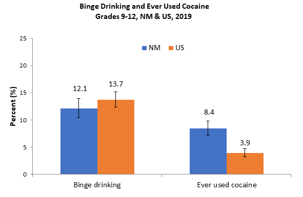

```{r setup, include=FALSE}
knitr::opts_chunk$set(cache = TRUE, echo=FALSE, warning=FALSE, cache.lazy = FALSE, cache.comments=FALSE)
```

```{r, echo=FALSE, message = FALSE, warning = FALSE, include=FALSE}
#options(kableExtra.latex.load_packages = FALSE)
library(ggplot2)
library(tidyverse)
library(haven)
library(readxl)
library(crosstable)
library(survey)
library(kableExtra)
library(expss)
library(labelled)
library(cowplot)
library(plyr)
library(dplyr)
library(magrittr)
library(scales)
library(ggpubr)

options(digits = 7)

yrbss_NM <- read_dta("YRRS/County & District Reports/Datasets/nmMS2021YRRS_nm_v6_int.dta")
yrrs_nm <- svydesign(id=~psu, strata=~strata, weights=~fwt_str, data=yrbss_NM)

#Importing data sets from previous years
#State level survey designs for district level analyses


year1 <- read_dta("YRRS/County & District Reports/Datasets/nmMS_2011_Ed.dta")
yrrs_nm_1 <- svydesign(id=~psu, strata=~strata, weights=~fwt_str, data=year1)

year2 <- read_dta("YRRS/County & District Reports/Datasets/nmMS_2013_Ed.dta")
yrrs_nm_2 <- svydesign(id=~psu, strata=~strata, weights=~fwt_str, data=year2)

year3 <- read_dta("YRRS/County & District Reports/Datasets/nmMS_2015_Ed_v2.dta")
yrrs_nm_3 <- svydesign(id=~psu, strata=~strata, weights=~fwt_str, data=year3)


year4 <- read_dta("YRRS/County & District Reports/Datasets/nmMS_2017_Ed_v3.dta")
yrrs_nm_4 <- svydesign(id=~psu, strata=~strata, weights=~fwt_str, data=year4)

year5 <- read_dta("YRRS/County & District Reports/Datasets/nmMS_2019_Ed_v3.dta")
yrrs_nm_5 <- svydesign(id=~psu, strata=~strata, weights=~fwt_str, data=year5)
options(survey.lonely.psu = "adjust")
options(survey.adjust.domain.lonely=TRUE)

# New Labels for some of our variables
yrbss_NM <- apply_labels(yrbss_NM,
                         #Risk factor questions
                         helmet =  "Rarely or never wore a bike helmet",
                         seatbelt =  "Rarely or never wore a seatbelt",
                         rodedui =  "Ever rode with a drinking driver",
                         weapon =  "Ever carried a weapon",
                         fight =  "Ever been in a physical fight",
                         bully =  "Ever been bullied on school property",
                         cbully =  "Ever been electronically bullied",
                         mental =  "Frequent mental distress",
                         consider =  "Ever seriously thought about killing yourself",
                         plan =  "Ever made a plan to kill yourself",
                         suiatt =  "Ever tried to kill yourself",
                         cigevr =  "Ever smoked cigarettes",
                         cig30 =  "Current cigarette smoker",
                         cig111 =  "Tried cigarette smoking before age 11",
                         vapeevr =  "Ever used an electronic vapor product",
                         vape30 =  "Current e-cigarette use",
                         cigar =  "Current cigar use",
                         hookah =  "Current hookah use",
                         spittob =  "Current spit tobacco use",
                         qntob5 =  "Any current tobacco use",
                         notob5 =  "No current tobacco use",
                         envsmoke =  "In a room with a cigarette smoker",
                         drnkevr =  "Ever drank alcohol",
                         drnk30 =  "Current alcohol use",
                         drnk11 =  "Drank alcohol before age 11",
                         drnk5 =  "Heavy episodic drinking",
                         rodedui =  "Ever rode with a drinking driver",
                         alceasy =  "It would be \"Very easy\" or \"Sort of easy\" to get alcohol",
                         alcwrng =  "I think it would be\"Wrong\" or \"Very wrong\" for someone my age to drink alcohol",
                         alcharm =  "I think people risk \"Moderate\" or \"Great\" harm from regular alcohol use",
                         alcparwg =  "My parents feel it would be \"Wrong\" or \"Very wrong\" for me to drink alcohol",
                         marievr =  "Ever used marijuana",
                         mari30 =  "Current marijuana use",
                         mari11 =  "Used marijuana before age 11",
                         synevr =  "Ever used synthetic marijuana",
                         cocaevr =  "Ever used cocaine",
                         inhevr =  "Ever used inhalants",
                         rxpainevr =  "Ever improperly used Rx pain meds",
                         rxpain =  "Current improper pain medication use",
                         sexevr =  "Ever had sexual intercourse",
                         sex11 =  "First sexual intercourse before age 11",
                         sex3 =  "Had sexual intercourse with 3 or more people in lifetime",
                         condom =  "Used a condom at last sexual intercourse",
                         nocondom =  "Did not use a condom during last sexual intercourse",
                         qnbk7day =  "Ate breakfast daily",
                         descowt =  "Describes self as slightly or very overweight",
                         losewt =  "Trying to lose weight",
                         fast =  "Fasted for weight control",
                         purge =  "Purged for weight control",
                         dietpill =  "Ever used diet products for weight control",
                         qnpa0day =  "No days of physical activity in the past week",
                         qnpa5day =  "Physical activity 5 days per week",
                         qnpa7day =  "Daily physical activity",
                         screent3h =  "Screen time 3 or more hours per day",
                         qndlype =  "Daily physical education at school",
                         team =  "Played on at least one sports team ",
                         concussion =  "Had a concussion from sports/physical activity",
                         dental =  "Saw a dentist in the past 12 months",
                         sleep8 =  "Got 8 or more hours of sleep per night on school nights",
                         gamble =  "Gambled at least once in the past 12 months",
                         homeless =  "In unstable housing",
                         #Resiliency factors with three responses (Check variable notes in Stata. Scheme is r3+question number. For example, r370 is derived from v70.)
                         r370 = "In my home, a parent or some other adult is interested in my school work",
                         r371 = "When I am not at home, one of my parents/guardians knows where I am and who I am with.",
                         r372 = "In my school, there are clear rules about what students can and cannot do.",
                         r373 = "At my school, there is a teacher or some other adult who listens to me when I have something to say.",
                         r374 = "I have a friend about my own age who really cares about me.",
                         r375 = "I have a friend about my own age who helps me when I'm having a hard time.",
                         r376 = "Outside of my home and school, there is an adult who really cares about me.",
                         r377 = "Outside of my home and school, I am a part of clubs, sports teams, church or temple, or other group activities.",
                         
                         #Resiliency factors with two responses
                         qn70 ="A parent or some other adult is interested in my school work",
                         qn71 = "When I am not at home, one of my parents/guardians knows where I am and who I am with.",
                         qn72 = "There are clear rules about what students can and cannot do.",
                         qn73 = "There is a teacher or some other adult who listens to me when I have something to say.",
                         qn74 = "I have a friend about my own age who really cares about me.",
                         qn75 = "I have a friend about my own age who helps me when I'm having a hard time.",
                         qn76 = "There is an adult who really cares about me.",
                         qn77 = "I am a part of clubs, sports teams, church or temple, or other group activities."
                         )
#Include this line of code to suppress sixth grade data for some counties
#suppress6 = TRUE

#Defining lists of years for trend function
years <- c("2011", "2013", "2015", "2017", "2019", "2021")
#Survey designs at county level
#year_survey <- c("yrrs_cnty_1", "yrrs_cnty_2", "yrrs_cnty_3", "yrrs_cnty_4", "yrrs_cnty_5", "yrrs_cnty")
#Survey designs at state/district level for district reports
year_survey <- c("yrrs_nm_1", "yrrs_nm_2", "yrrs_nm_3", "yrrs_nm_4", "yrrs_nm_5", "yrrs_nm")
datasets <- list(year1, year2, year3, year4, year5, yrbss_NM)

#length(yrbss_NM$cntytxt[(yrbss_NM$cntytxt =={params$counties})])

```


```{r Importing_Functions}
source("Report Functions (Only NM_SD).R")
```


\newpage

## Suggested citation: {.unlisted .unnumbered}

New Mexico Youth Risk and Resiliency Survey: Middle School Survey Results 2021, `r {params$counties}` County. (2021). Epidemiology and Response Division, New Mexico Department of Health; School and Family Support Bureau, New Mexico Public Education Department;and University of New Mexico Prevention Research Center. https://youthrisk.org/publications/county-reports/.

&nbsp;    
&nbsp;    
&nbsp;  
This publication was produced by the New Mexico Department of Health (NM DOH), the Public Education Department (NM PED), and the University of New Mexico Prevention Research Center. The NM YRRS receives support from the Centers for Disease Control and Prevention in cooperation with the NM PED through Grant number 6NU87PS0043 14-05-01. For information about administration and methods used in implementation of the New Mexico Youth Risk and Resiliency Survey (NM YRRS), see [www.youthrisk.org](https://www.youthrisk.org).


\newpage

### ACKNOWLEDGEMENTS {.unlisted .unnumbered}
This report is a product of the NM Youth Risk and Resiliency Survey (YRRS), a project that characterizes risk behaviors and resiliency/protective factors among New Mexico youth. The YRRS is a joint project of the New Mexico Department of Health (NMDOH) the New Mexico Public Education Department (PED), and the University of New Mexico Prevention Research Center (UNM PRC), with support and technical assistance from the Office of Substance Abuse Prevention, Behavioral Health Services Division (OSAP-BHSD); the Albuquerque Area Southwest Tribal Epidemiology Center (AASTEC); and the U.S. Centers for Disease Control and Prevention, Division of Adolescent and School Health (CDC-DASH). Gratitude is extended to the individuals listed below for their contribution to developing and producing this report. (Individuals who served on the NM-YRRS 2019 Steering Committee are identified by an asterisk (*).)  

### NEW MEXICO DEPARTMENT OF HEALTH {.unlisted .unnumbered}
Patrick Allen, Cabinet Secretary  
Laura Parajon, MD, MPH, Deputy Secretary, State Epidemiologist and Acting Division Director, Emergency and Response Division  
Rachel Wexler, Acting Bureau Chief, Injury and Behavioral Epidemiology Bureau  
Dan Green, MPH, Survey Epidemiologist, Injury and Behavioral Epidemiology Bureau*  
Hayley Peterson, MPH, Drug Overdose Morbidity Epidemiologist, Injury and Behavioral Epidemiology Bureau*  
James Farmer, MPH, Director, Office of School and Adolescent Health*  
Dylan Pell, MPH, MSW, Mental Health Epidemiologist, Injury and Behavioral Epidemiology Bureau*  

### NEW MEXICO PUBLIC EDUCATION DEPARTMENT {.unlisted .unnumbered}
Kurt Steinhaus, Ed.D., Secretary of Education  
Anne Marlow-Geter, Director, Safe & Healthy Schools Bureau (interim)  

### ALBUQUERQUE AREA SOUTHWEST TRIBAL EPIDEMIOLOGY CENTER {.unlisted .unnumbered} 
Kevin English, DrPh, MPH, Director  
Carolyn Parshall, MPH, Epidemiologist*  
Cynthia Garcia, BS, CDC Public Health Associate*  

### NEW MEXICO HUMAN SERVICES DEPARTMENT, BEHAVIORAL HEALTH SERVICES DIVISION {.unlisted .unnumbered} 
Neal Bowen, PhD, Director, Behavioral Health Services Division  
Jacqueline Nielsen, Deputy Director, Behavioral Health Services Division  
Antonette Tone Silva-Jose, Prevention Operations Manager, Office of Substance Abuse Prevention  

The NM Department of Health receives support for the NM YRRS from the Centers for Disease Control
and Prevention in cooperation through Grant number 6NU87PS0043 14-05-01.

\newpage  
### 2021 YRRS Team at UNM Prevention Research Center {.unlisted .unnumbered}   
Shane Barton, Programmer Analyst   
Kelly Cockrell, Web Designer and Communications   
Edward Davis, Statistician   
Kevin Estes, PhD, Postdoctoral Fellow   
Courtney FitzGerald, MSSW, LMSW, MPH, Senior Research Scientist*     
Jeremy Gonzales, Professional Intern   
Alysandra Jackson, Professional Intern   
M. Rebecca Kilburn, PhD, Research Professor*     
Oscar Mendez-Cera, Associate Scientist   
Kelly Valdez, Professional Intern   
Robyn Viera, MA, Scientific Research Manager*                          
\newpage  
\tableofcontents


```{r echo=FALSE, warning=FALSE, message=FALSE}

yrbss_ms_district <- subset(yrbss_NM, sdid=={params$District})
#Response rates
#Number of students in current county who responded


Profiles <- c(" ", "Girls", "Boys", "American Indian or Alaska Native", "Asian", "Black or African-American", "Hispanic", "Native Hawaiian or Pacific Islander ", "White", "6th", "7th", "8th", "Other")

# Totals <- c(total_responses, girl_r, boy_r, AIAN_r, Asian_r, AA_r, Hisp_r, NHOPI_r, WH_r, nine_r, ten_r, eleven_r, twelve_r, other_r)
Totals <- c(length(yrbss_ms_district$sdid)
            #Girls/boys
            , length(na.omit(yrbss_ms_district$sex[(yrbss_ms_district$sex==1)]))
            , length(na.omit(yrbss_ms_district$sex[(yrbss_ms_district$sex==2)]))
            #Race/ethnicity
            , length(na.omit(yrbss_ms_district$ai[(yrbss_ms_district$ai==1)]))
            , length(na.omit(yrbss_ms_district$as[(yrbss_ms_district$as==1)]))
            , length(na.omit(yrbss_ms_district$aa[(yrbss_ms_district$aa==1)]))
            , length(na.omit(yrbss_ms_district$hisp[(yrbss_ms_district$hisp==1)]))
            , length(na.omit(yrbss_ms_district$pi[(yrbss_ms_district$pi==1)]))
            , length(na.omit(yrbss_ms_district$wh[(yrbss_ms_district$wh==1)]))
            #Grade level
            , length(na.omit(yrbss_ms_district$grade[(yrbss_ms_district$grade==1)]))
            , length(na.omit(yrbss_ms_district$grade[(yrbss_ms_district$grade==2)]))
            , length(na.omit(yrbss_ms_district$grade[(yrbss_ms_district$grade==3)]))
            #, length(na.omit(yrbss_ms_district$grade[(yrbss_ms_district$grade==4)]))
            , length(yrbss_ms_district$grade[is_tagged_na(yrbss_ms_district$grade, "a")]))
Percents <- c(rep("a", length(Totals)))

for (i in 1:length(Totals)){
  Percents[i] <- percent(Totals[i]/Totals[1],accuracy = 0.1)
}
            

Participation_Rates <- data.frame(Profiles, Totals, Percents)
colnames(Participation_Rates)[1:3] <- c("Profile of students surveyed", "Number of students who responded", "Percent (%)")

Participation_table <- kbl(Participation_Rates, booktabs = T, align = c('l', 'r', 'r'), position = 'b') %>% pack_rows(index = c("Total" = 1, "Gender" = 2, "Race/Ethnicity" = 6, "Grade Level" = 4))
#kable_styling(Participation_table, position = "center", latex_options =  "basic")


```

\newpage  
\centering
### New Mexico Youth Risk and Resiliency Survey {.unlisted .unnumbered}  
### Participation in `r {params$District_name}`  
### Middle School (Grades 6-8) {.unlisted .unnumbered}  
\raggedright

The response rate for `r {params$District_name}` was `r signif(yrbss_NM$rr_sd[(yrbss_NM$sdid=={params$District})][1], 3)*100`%.  
A high response rate produces survey results that are more representative of the student population.  
A response rate of at least 60% allows generalization of results to the entire student body. A response 
rate of 70% is excellent and allows a high degree of confidence in results. Response rates below 60% 
are considered low, and caution should be exercised in interpreting results. Low response rates 
indicate that the data may represent only students who participated in the survey and not necessarily 
the entire student body


```{r echo=FALSE, warning=FALSE, message=FALSE}
Participation_table

```

\newpage  
\centering
### New Mexico Youth Risk and Resiliency Survey {.unlisted .unnumbered}  
# Risk Behaviors at a Glance  
### `r {params$District_name}` {.unlisted .unnumbered}  
### Grades 6-8 {.unlisted .unnumbered}
\raggedright
```{r, echo=FALSE, warning=FALSE, message=FALSE}
Table_function <- function(varlist) {
  
  Data_frame_values <- data.frame(matrix(ncol=9,nrow=length(varlist)))
  colnames(Data_frame_values) <- c("Indicator", "sds_Value", "sds_ci_l", "sds_ci_u", "sds_ci", "NM_Value", "NM_ci_l", "NM_ci_u", "NM_ci")
  ########################################################

  for(i in 1:length(varlist)){
    
    varname <- varlist[i]
    Data_frame_values[i,1] <- var_label(yrbss_NM[varname][[1]])
    
    #District level values
    Data_frame_values[i,2:4] <- round((svyby(as.formula( paste0("~", varname)), ~sdid=={params$District}, yrrs_nm, svyciprop, vartype ="ci",method="xlogit", multicore=TRUE, na.rm=T))[2,2:4] *100, 1)
    Data_frame_values[i,5] <- paste0("(",Data_frame_values[i,3], "-",Data_frame_values[i,4],")")
    
    #NM level values
    Data_frame_values[i,6] <- round((svymean(yrbss_NM[varname], yrrs_nm, multicore=TRUE, na.rm=T))[1] *100, 1)
    Data_frame_values[i,7:8] <- round((confint(svymean(yrbss_NM[varname], yrrs_nm, multicore=TRUE, na.rm=T)))[1:2] *100, 1)
    Data_frame_values[i,9] <- paste0("(",Data_frame_values[i,7], "-",Data_frame_values[i,8],")")
    
  }

  Data_frame_values$Indicator <- factor(Data_frame_values$Indicator, levels = var_label(yrbss_NM[varlist]))
  #Data_frame_values <- data.frame(Indicator, sds_Value, sds_ci, NM_Value, NM_ci)

  return(Data_frame_values)
}

table_bb <- Table_function(c("helmet", "seatbelt", "rodedui", "weapon", 
                             "fight", "bully","cbully",
                             "mental", "consider", "plan", "suiatt",
                             "cigevr", "cig30", "cigar", "spittob", "hookah",
                             "vapeevr", "vape30", "envsmoke",
                             "drnkevr", "drnk30", "drnk11", "drnk5",
                             "marievr", "mari30", "mari11", "synevr", "cocaevr","inhevr", "rxpainevr", "rxpain"))
header_groups = c(1,2,2)
names(header_groups) = c(" ",{params$District_name}, "New Mexico")

kbl(table_bb[,c(1,2,5,6,9)], booktabs = T, align = NULL, position = 'b', row.names = FALSE, col.names = c("Indicator", "%", "(95% CI)", "%", "(95% CI)")) %>%
  #kable_styling(latex_options =  "striped") %>%
  add_header_above(header_groups) %>%
  pack_rows( index = c("Personal Safety" = 7, "Mental Health and Suicidal Behaviors" = 4, "Tobacco Use" = 8, "Alcohol Use"=4, "Drug Use"=8))
```

\newpage
\centering
### New Mexico Youth Risk and Resiliency Survey {.unlisted .unnumbered}  
# Risk Behaviors at a Glance  {.unlisted .unnumbered} 
### `r {params$District_name}` {.unlisted .unnumbered}  
### Grades 6-8 {.unlisted .unnumbered}
\raggedright

```{r, echo=FALSE, warning=FALSE, message=FALSE, cache.rebuild=FALSE}
table_cc <- Table_function(c("sexevr", "sex11",
                             "qnbk7day", "descowt", "losewt", "fast", "purge", "dietpill",
                             "qnpa0day", "qnpa5day", "qnpa7day", "screent3h", "qndlype", "team",
                             "concussion", "dental", "sleep8", "gamble", "homeless"))

kbl(table_cc[,c(1,2,5,6,9)], booktabs = T, align = NULL, position = 'b', row.names = FALSE, col.names = c("Indicator", "%", "(95% CI)", "%", "(95% CI)")) %>%
  #kable_styling(latex_options =  "striped") %>%
  add_header_above(header_groups) %>%
  pack_rows( index = c("Sexual Behavior"=2, "Body Weight and Nutrition"=6, "Physical Activity"=6, "Other Characteristics" = 5))
```
\newpage

&nbsp;

\newpage


&nbsp;
&nbsp;

\centering

### New Mexico Youth Risk and Resiliency Survey (YRRS) {.unlisted .unnumbered}  
##  Highlights  
### `r {params$District_name}` {.unlisted .unnumbered}  
### Grades 6-8 {.unlisted .unnumbered}

\raggedright

\newpage

Highlights from the New Mexico Youth Risk and Resiliency Survey (YRRS)  
`r {params$District_name}`   
Middle School (Grades 6-8)
&nbsp;


\par
|   Statewide results from the 2021 Middle School NM YRRS revealed both encouraging and concerning trends in New Mexico. Rates of youth alcohol use, drug use and most tobacco use decreased over the past 10 years. Trends in rates of behaviors associated with violence were mixed, as the rates of physical fighting and carrying a weapon to school both decreased, while rates of sexual and dating violence remained largely unchanged. The rate of being bullied at school decreased, while the rate of electronic bullying showed little variation.  

|   Of serious concern were the increasing rates for obesity, suicidal behaviors, and characteristics associated with mental health.

|   The COVID-19 pandemic played a big part in the 2021 YRRS. When data were collected in the fall and winter of 2021, school were facing COVID-related closures and high rates of absenteeism, resulting in decreased YRRS participation at the student and school level. COVID may also have altered student behavior, as there were fewer opportunities for social interaction, and fewer opportunities to engage in socially-related high-risk behaviors. COVID also may have affected the emotional well-being of students. The 2021 YRRS included questions about the effect of COVID on students’ lives.

|   The rate of obesity or overweight, after increasing for several years, has not increased since 2015. Rates for most violence-related behaviors have not changed greatly. However, the rate of ever being physically forced to have sexual intercourse is higher in New Mexico than in the U.S.


|   This report puts the findings for New Mexico alongside YRRS results for `r {params$District_name}`. Thank you for using this information to make New Mexico and your own community a safer and healthier place for all young people. For more YRRS results, see www.youthrisk.org.

\newpage

##### Personal Safety {.unlisted .unnumbered}   

&nbsp;   

```{r, echo=FALSE, warning=FALSE, message=FALSE, fig.height = 4.5, fig.width=6.5}
barplot_district(c("helmet", "seatbelt","rodedui","weapon", "fight", "bully","cbully"), "Personal Safety",ms=TRUE )
```

\newpage

##### Mental Health {.unlisted .unnumbered}   

&nbsp;   

```{r, echo=FALSE, warning=FALSE, message=FALSE, fig.height = 4.5, fig.width=6.5}
barplot_district(c("mental", "consider","plan","suiatt"), "Mental Health and Suicidal Behaviors", ms=TRUE)
```

\newpage

##### Tobacco Use {.unlisted .unnumbered}   

&nbsp;   

```{r, echo=FALSE, warning=FALSE, message=FALSE, fig.height = 5, fig.width=6.5}
print(barplot_district(c("cigevr","cig30","cigar","spittob", "hookah","vapeevr", "vape30","envsmoke"), "Tobacco Use", ms=TRUE))
```

\newpage

##### Alcohol Use {.unlisted .unnumbered}   

&nbsp;   

```{r, echo=FALSE, warning=FALSE, message=FALSE, fig.height = 5, fig.width=6.5}
print(barplot_district(c("drnkevr","drnk30","drnk11","drnk5"), "Alcohol Use", ms=TRUE))
```

\newpage

##### Drug Use {.unlisted .unnumbered}  

&nbsp;  

```{r, echo=FALSE, warning=FALSE, message=FALSE, fig.height = 6, fig.width=6.5}
print(barplot_district(c("marievr", "mari30", "mari11", "synevr", "cocaevr", "inhevr", "rxpainevr", "rxpain"), "Drug Use", ms=TRUE))
```

\newpage

##### Sexual Behavior {.unlisted .unnumbered}

&nbsp;

```{r, echo=FALSE, warning=FALSE, message=FALSE, fig.height = 4, fig.width=6.5}
print(barplot_district(c("sexevr","sex11"), "Sexual Behavior", ms=TRUE))
```


\newpage

##### Physical Activity, Body Weight, and Nutrition {.unlisted .unnumbered}

&nbsp;


```{r, echo=FALSE, warning=FALSE, message=FALSE, fig.height = 4, fig.width=6.5}
print(barplot_district(c("qnbk7day","descowt","losewt", "fast", "purge", "dietpill"), "Body Weight and Nutrition", ms=TRUE))
print(barplot_district(c("qnpa0day", "qnpa5day","qnpa7day","screent3h", "qndlype", "team"), "Physical Activity", ms=TRUE))
```

\newpage

##### Other Characteristics {.unlisted .unnumbered}

&nbsp;

```{r, echo=FALSE, warning=FALSE, message=FALSE, fig.height = 6, fig.width=6.5}
print(barplot_district(c("concussion","dental","sleep8", "gamble", "homeless"), "Other Characteristics", ms=TRUE))
```
\newpage


&nbsp;
&nbsp;

\centering

## `r {params$District_name}` {.unlisted .unnumbered} 
## Charts

\raggedright

\newpage
### Personal Safety
```{r, echo=FALSE, warning=FALSE, message=FALSE, fig.height = 4.5, fig.width=6.5}
trendplot(c("helmet", "seatbelt"), graph_subtitle = "Personal Safety: Behaviors Associated with Unintentional Injury", ms=TRUE, district_level=TRUE)

```
```{r, echo=FALSE, warning=FALSE, message=FALSE, fig.height = 17, fig.width=12, fig.align = "center"}
barplot_group(c("helmet", "seatbelt"), "Personal Safety: Behaviors Associated with Unintentional Injury", ms=TRUE, level = "district")
```

\newpage

```{r, echo=FALSE, warning=FALSE, message=FALSE, fig.height = 4.5, fig.width=6.5}
trendplot(c("weapon", "fight"), graph_subtitle = "Personal Safety: Behaviors Associated with Violence", ms=TRUE, district_level=TRUE)
```
\newpage
```{r, echo=FALSE, warning=FALSE, message=FALSE, fig.height = 17, fig.width=12, fig.align = "center"}
barplot_group(c("weapon", "fight"), "Personal Safety: Behaviors Associated with Violence", ms=TRUE, level="district")
```
\newpage
```{r, echo=FALSE, warning=FALSE, message=FALSE, fig.height = 4.5, fig.width=6.5}
trendplot(c("bully", "cbully"), graph_subtitle = "Personal Safety: Bullying", ms=TRUE, district_level=TRUE)
```
\newpage
```{r, echo=FALSE, warning=FALSE, message=FALSE, fig.height = 17, fig.width=12, fig.align = "center"}
barplot_group(c("bully", "cbully"), "Personal Safety: Bullying", ms=TRUE, level="district")
```

\newpage
### Mental Health and Suicidal Behaviors   
```{r, echo=FALSE, warning=FALSE, message=FALSE, fig.height = 4.5, fig.width=6.5}
trendplot(c("consider", "plan", "suiatt"), graph_subtitle = "Mental Health and Suicidal Behaviors", ms=TRUE, district_level=TRUE)
```
\newpage
```{r, echo=FALSE, warning=FALSE, message=FALSE, fig.height = 17, fig.width=12, fig.align = "center"}
barplot_group(c("mental", "consider", "plan", "suiatt"), "Mental Health and Suicidal Behaviors", ms=TRUE, level="district")
```

### Tobacco Use and Exposure   
```{r, echo=FALSE, warning=FALSE, message=FALSE, fig.height = 4.5, fig.width=6.5}
trendplot(c("vapeevr", "cigevr"), graph_subtitle = "Tobacco Use and Exposure: Ever used Tobacco", ms=TRUE, district_level=TRUE)
trendplot(c("vape30", "cig30", "cigar"), graph_subtitle = "Tobacco Use and Exposure: Current Tobacco use", ms=TRUE, district_level=TRUE)
```

```{r, echo=FALSE, warning=FALSE, message=FALSE, fig.height = 4.5, fig.width=6.5}
trendplot(c("qntob5", "hookah", "spittob"), graph_subtitle = "Tobacco Use and Exposure: Current Tobacco use", ms=TRUE, district_level=TRUE)
```
Any current tobacco use:   
* Before 2013: Used cigarettes, cigars, or spit tobacco in the past 30 days.   
* 2015, 2017, 2019, 2021:  Used cigarettes, cigars, spit tobacco, hookah to smoke tobacco, or e-cigarettes (electronic vapor products) in the past 30 days.   

\newpage

```{r, echo=FALSE, warning=FALSE, message=FALSE, fig.height = 17, fig.width=12, fig.align = "center"}
barplot_group(c("cigevr", "cig30", "cig111"), "Tobacco Use and Exposure", ms=TRUE, level="district")
barplot_group(c("vapeevr", "vape30", "cigar", "hookah","spittob"), "Tobacco Use and Exposure", ms=TRUE, level="district")
barplot_group(c("qntob5", "notob5", "envsmoke"), "Tobacco Use and Exposure", ms=TRUE, level="district")
```

\newpage
### Alcohol Use   
```{r, echo=FALSE, warning=FALSE, message=FALSE, fig.height = 6, fig.width=7, fig.align = "center"}
trendplot(c("drnkevr", "drnk30", "drnk5", "drnk11"), graph_subtitle = "Alcohol Use", ms=TRUE, district_level=TRUE)
```
\newpage
```{r, echo=FALSE, warning=FALSE, message=FALSE, fig.height = 17, fig.width=12, fig.align = "center"}
barplot_group(c("drnkevr", "drnk30", "drnk11"), "Alcohol Use", ms=TRUE, level="district")
barplot_group(c("drnk5", "rodedui"), "Alcohol Use", ms=TRUE, level="district")
barplot_group(c("alceasy", "alcwrng", "alcharm", "alcparwg"), "Alcohol Use", ms=TRUE, level="district")
```


\newpage
### Drug Use   
```{r, echo=FALSE, warning=FALSE, message=FALSE, fig.height = 6, fig.width=7, fig.align = "center"}
trendplot(c("marievr", "mari30", "mari11"), graph_subtitle = "Drug Use: Marijuana", ms=TRUE, district_level=TRUE)
trendplot(c("synevr", "cocaevr", "inhevr", "rxpainevr", "rxpain"), graph_subtitle = "Drug Use: Other Drugs", ms=TRUE, district_level=TRUE)
```
\newpage
```{r, echo=FALSE, warning=FALSE, message=FALSE, fig.height = 17, fig.width=12, fig.align = "center"}
barplot_group(c("marievr", "mari30", "mari11"), "Drug Use: Marijuana", ms=TRUE, level="district")
barplot_group(c("synevr", "cocaevr", "inhevr", "rxpainevr", "rxpain"), "Drug Use: Other Drugs", ms=TRUE, level="district")
```

\newpage
### Sexual Behaviors   
```{r, echo=FALSE, warning=FALSE, message=FALSE, fig.height = 6, fig.width=7, fig.align = "center"}
trendplot(c("sexevr", "condom"), graph_subtitle = "Sexual Behaviors", ms=TRUE, district_level=TRUE)
```

\newpage

```{r, echo=FALSE, warning=FALSE, message=FALSE, fig.height = 17, fig.width=12, fig.align = "center", cache.rebuild=TRUE}
options(survey.lonely.psu = "adjust")
options(survey.adjust.domain.lonely=TRUE)
barplot_group(c("sexevr", "sex11", "sex3", "condom", "nocondom"), "Sexual behaviors", ms=TRUE, level="district")
```

### Body Weight and Nutrition   
```{r echo=FALSE, fig.align="center", fig.height=6, fig.width=7.5, message=FALSE, warning=FALSE}
trendplot(c("qnbk7day", "fast"), graph_subtitle = "Body Weight and Nutrition", ms=TRUE, district_level=TRUE)
```
\newpage
```{r, echo=FALSE, warning=FALSE, message=FALSE, fig.height = 17, fig.width=12, fig.align = "center"}
barplot_group(c("qnbk7day", "descowt", "losewt", "fast", "purge", "dietpill"), "Body Weight and Nutrition", ms=TRUE, level="district")
```

\newpage
### Physical Activity   
```{r, echo=FALSE, warning=FALSE, message=FALSE, fig.height = 6, fig.width=7, fig.align = "center"}
trendplot(c("qnpa7day", "qndlype"), graph_subtitle = "Physical Activity", ms=TRUE, district_level=TRUE)
```

\newpage

```{r, echo=FALSE, warning=FALSE, message=FALSE, fig.height = 17, fig.width=12, fig.align = "center"}
barplot_group(c("qnpa0day", "qnpa5day", "qnpa7day"), "Physical Activity", ms=TRUE, level="district")
barplot_group(c("screent3h", "qndlype", "team"), "Physical Activity", ms=TRUE, level="district")
```

\newpage
### Other Characteristics   
```{r, echo=FALSE, warning=FALSE, message=FALSE, fig.height = 6, fig.width=7, fig.align = "center"}
trendplot(c("concussion", "dental", "sleep8", "gamble"), graph_subtitle = "Other Characteristics", ms=TRUE, district_level=TRUE)
```
\newpage   
```{r, echo=FALSE, warning=FALSE, message=FALSE, fig.height = 17, fig.width=12, fig.align = "center"}
barplot_group(c("concussion", "dental", "sleep8", "gamble", "homeless"), "Other Characteristics", ms=TRUE, level="district")
```

\newpage


&nbsp;
&nbsp;
&nbsp;
&nbsp;

\centering

# Resiliency/Protective Factors

\raggedright

\newpage
```{r, echo=FALSE, warning=FALSE, message=FALSE, fig.height = 4, fig.width=6, fig.align = "center"}
barplot_district_2(c("qn70", "qn71"), "Resiliency/Protective Factors in the Home", ms=TRUE) + guides(x.sec = guide_none(title = "It is \"Very much true\" or \"Pretty much true\" that in my home..."))


barplot_district_2(c("qn72", "qn73"), "Resiliency/Protective Factors in the School", ms=TRUE) + guides(x.sec = guide_none(title = "It is \"Very much true\" or \"Pretty much true\" that in my school..."))

```

\newpage
```{r, echo=FALSE, warning=FALSE, message=FALSE, fig.height = 4, fig.width=6, fig.align = "center"}
barplot_district_2(c("qn76", "qn77"), "Resiliency/Protective Factors in the Community", ms=TRUE)  + guides(x.sec = guide_none(title = "It is \"Very much true\" or \"Pretty much true\" that outside my home and school..."))

barplot_district_2(c("qn74", "qn75"), "Resiliency/Protective Factors with Peers and Personal", ms=TRUE) + guides(x.sec = guide_none(title = "It is \"Very much true\" or \"Pretty much true\" that..."))
```

\newpage

&nbsp;

\newpage

&nbsp;
&nbsp;

\centering

# Relationship Between Selected Risk Behaviors and Resiliency/Protective Factors

\raggedright

\newpage

```{r echo=FALSE, fig.height=13, fig.width=12, message=FALSE, warning=FALSE, cache.rebuild=TRUE}
barplot_resiliency("fight", c("r377", "r376", "r375", "r374", "r373", "r372", "r371", "r370"), "region", ms=TRUE)

#risk_props
```

#### How to read this chart: {.unlisted .unnumbered}
 * Of those who said it was 'Not true at all' that a parent or other adult was interested in their school work, `r risk_props[1]`% were in a physical fight.
 * Of those who said it was 'A little but or pretty much true' that a parent or other adult was interested in their school work, `r risk_props[2]`% were in a physical fight.
 * Of those who said it was 'Very much true' that a parent or other adult was interested in their school work, `r risk_props[3]`% were in a physical fight.

\newpage

```{r, echo=FALSE, warning=FALSE, message=FALSE, fig.height = 13, fig.width=12, fig.align = "center", cache.rebuild=TRUE}
barplot_resiliency("weapon", c("r377", "r376", "r375", "r374", "r373", "r372", "r371", "r370"), "region", ms=TRUE)
```
#### How to read this chart: {.unlisted .unnumbered}
 * Of those who said it was 'Not true at all' that a parent or other adult was interested in their school work, `r risk_props[1]`% ever carried a weapon such as a gun, knife, or club.
 * Of those who said it was 'A little but or pretty much true' that a parent or other adult was interested in their school work, `r risk_props[2]`% ever carried a weapon such as a gun, knife, or club.
 * Of those who said it was 'Very much true' that a parent or other adult was interested in their school work, `r risk_props[3]`% ever carried a weapon such as a gun, knife, or club.
 
\newpage

```{r, echo=FALSE, warning=FALSE, message=FALSE, fig.height = 13, fig.width=12, fig.align = "center", cache.rebuild=TRUE}
barplot_resiliency("consider", c("r377", "r376", "r375", "r374", "r373", "r372", "r371", "r370"), "region", ms=TRUE)
```
#### How to read this chart: {.unlisted .unnumbered}
 * Of those who said it was 'Not true at all' that a parent or other adult was interested in their school work, `r risk_props[1]`% ever seriously thought about killing themselves.
 * Of those who said it was 'A little but or pretty much true' that a parent or other adult was interested in their school work, `r risk_props[2]`% ever seriously thought about killing themselves.
 * Of those who said it was 'Very much true' that a parent or other adult was interested in their school work, `r risk_props[3]`% ever seriously thought about killing themselves.
 
\newpage

```{r, echo=FALSE, warning=FALSE, message=FALSE, fig.height = 13, fig.width=12, fig.align = "center", cache.rebuild=TRUE}
barplot_resiliency("suiatt", c("r377", "r376", "r375", "r374", "r373", "r372", "r371", "r370"), "region", ms=TRUE)
```
#### How to read this chart: {.unlisted .unnumbered}
 * Of those who said it was 'Not true at all' that a parent or other adult was interested in their school work, `r risk_props[1]`% ever tried to kill themselves.
 * Of those who said it was 'A little but or pretty much true' that a parent or other adult was interested in their school work, `r risk_props[2]`% ever tried to kill themselves. 
 * Of those who said it was 'Very much true' that a parent or other adult was interested in their school work, `r risk_props[3]`% ever tried to kill themselves.
 
\newpage

```{r, echo=FALSE, warning=FALSE, message=FALSE, fig.height = 13, fig.width=12, fig.align = "center", cache.rebuild=TRUE}
barplot_resiliency("cig30", c("r377", "r376", "r375", "r374", "r373", "r372", "r371", "r370"), "region", ms=TRUE)
```
#### How to read this chart: {.unlisted .unnumbered}
 * Of those who said it was 'Not true at all' that a parent or other adult was interested in their school work, `r risk_props[1]`% smoked a cigarette in the last 30 days.
 * Of those who said it was 'A little but or pretty much true' that a parent or other adult was interested in their school work, `r risk_props[2]`% smoked a cigarette in the last 30 days.
 * Of those who said it was 'Very much true' that a parent or other adult was interested in their school work, `r risk_props[3]`% smoked a cigarette in the last 30 days.
 
\newpage

```{r, echo=FALSE, warning=FALSE, message=FALSE, fig.height = 13, fig.width=12, fig.align = "center", cache.rebuild=TRUE}
barplot_resiliency("vape30", c("r377", "r376", "r375", "r374", "r373", "r372", "r371", "r370"), "region", ms=TRUE)
```
#### How to read this chart: {.unlisted .unnumbered}
 * Of those who said it was 'Not true at all' that a parent or other adult was interested in their school work, `r risk_props[1]`% were current users of e-cigarettes/vapor products.
 * Of those who said it was 'A little but or pretty much true' that a parent or other adult was interested in their school work, `r risk_props[2]`% were current users of e-cigarettes/vapor products.
 * Of those who said it was 'Very much true' that a parent or other adult was interested in their school work, `r risk_props[3]`% were current users of e-cigarettes/vapor products.
 
\newpage

```{r, echo=FALSE, warning=FALSE, message=FALSE, fig.height = 13, fig.width=12, fig.align = "center", cache.rebuild=TRUE}
barplot_resiliency("drnkevr", c("r377", "r376", "r375", "r374", "r373", "r372", "r371", "r370"), "region", ms=TRUE)
```
#### How to read this chart: {.unlisted .unnumbered}
 * Of those who said it was 'Not true at all' that a parent or other adult was interested in their school work, `r risk_props[1]`% ever drank alcohol.
 * Of those who said it was 'A little but or pretty much true' that a parent or other adult was interested in their school work, `r risk_props[2]`% ever drank alcohol.
 * Of those who said it was 'Very much true' that a parent or other adult was interested in their school work, `r risk_props[3]`% ever drank alcohol.
 
\newpage

```{r, echo=FALSE, warning=FALSE, message=FALSE, fig.height = 13, fig.width=12, fig.align = "center", cache.rebuild=TRUE}
barplot_resiliency("drnk30", c("r377", "r376", "r375", "r374", "r373", "r372", "r371", "r370"), "region", ms=TRUE)
```
#### How to read this chart: {.unlisted .unnumbered}
 * Of those who said it was 'Not true at all' that a parent or other adult was interested in their school work, `r risk_props[1]`% were current alcohol drinkers.
 * Of those who said it was 'A little but or pretty much true' that a parent or other adult was interested in their school work, `r risk_props[2]`% were current alcohol drinkers.
 * Of those who said it was 'Very much true' that a parent or other adult was interested in their school work, `r risk_props[3]`% were current alcohol drinkers.
 
\newpage

```{r, echo=FALSE, warning=FALSE, message=FALSE, fig.height = 13, fig.width=12, fig.align = "center", cache.rebuild=TRUE}
barplot_resiliency("marievr", c("r377", "r376", "r375", "r374", "r373", "r372", "r371", "r370"), "region", ms=TRUE)
```
#### How to read this chart: {.unlisted .unnumbered}
 * Of those who said it was 'Not true at all' that a parent or other adult was interested in their school work, `r risk_props[1]`% ever used marijuana.
 * Of those who said it was 'A little but or pretty much true' that a parent or other adult was interested in their school work, `r risk_props[2]`% ever used marijuana.
 * Of those who said it was 'Very much true' that a parent or other adult was interested in their school work, `r risk_props[3]`% ever used marijuana.
 
\newpage

```{r, echo=FALSE, warning=FALSE, message=FALSE, fig.height = 13, fig.width=12, fig.align = "center", cache.rebuild=TRUE}
barplot_resiliency("sexevr", c("r377", "r376", "r375", "r374", "r373", "r372", "r371", "r370"), "region", ms=TRUE)
```
#### How to read this chart: {.unlisted .unnumbered}
 * Of those who said it was 'Not true at all' that a parent or other adult was interested in their school work, `r risk_props[1]`% ever had sexual intercourse.
 * Of those who said it was 'A little but or pretty much true' that a parent or other adult was interested in their school work, `r risk_props[2]`% ever had sexual intercourse.
 * Of those who said it was 'Very much true' that a parent or other adult was interested in their school work, `r risk_props[3]`% ever had sexual intercourse.
 
\newpage

```{r, echo=FALSE, warning=FALSE, message=FALSE, fig.height = 13, fig.width=12, fig.align = "center", cache.rebuild=TRUE}
barplot_resiliency("qnpa7day", c("r377", "r376", "r375", "r374", "r373", "r372", "r371", "r370"), "region", ms=TRUE)
```
#### How to read this chart: {.unlisted .unnumbered}
 * Of those who said it was 'Not true at all' that a parent or other adult was interested in their school work, `r risk_props[1]`% were sexually active.
 * Of those who said it was 'A little but or pretty much true' that a parent or other adult was interested in their school work, `r risk_props[2]`% were sexually active.
 * Of those who said it was 'Very much true' that a parent or other adult was interested in their school work, `r risk_props[3]`% were sexually active.
 
\newpage


&nbsp;
&nbsp;
&nbsp;
&nbsp;

\centering

# Appendix A: Questionnaire with Results


\newpage

```{r echo=FALSE, warning=FALSE, message=FALSE}
#yrbss_hs_district <- subset(yrrs2019, cntytxt=={params$counties})
Questionnaire <- read_excel("Questionnaires_HS-MS_2021.xlsx", 
    sheet = "MiddleSchool_2021_Questionnaire")

# Personal_Info_Questions <- (Questionnaire$`NM 2021 HS YRRS Text`[(Questionnaire$`Row Type`=="Response")])[1:21]
Personal_Info_Questions <- (Questionnaire$`NM 2021 MS YRRS Text`[(Questionnaire$`Row Type`=="Response")])[1:20]
#sum(yrbss_hs_district$v1[yrbss_hs_district$v1==2], na.rm=TRUE) #Get number of responses with answer


Totals <- c(#How old are you?
            length(na.omit(yrbss_ms_district$v1[yrbss_ms_district$v1==1])),
            length(na.omit(yrbss_ms_district$v1[yrbss_ms_district$v1==2])),
            length(na.omit(yrbss_ms_district$v1[yrbss_ms_district$v1==3])),
            length(na.omit(yrbss_ms_district$v1[yrbss_ms_district$v1==4])),
            length(na.omit(yrbss_ms_district$v1[yrbss_ms_district$v1==5])),
            length(na.omit(yrbss_ms_district$v1[yrbss_ms_district$v1==6])),
            length(na.omit(yrbss_ms_district$v1[yrbss_ms_district$v1==7])),
            #What is your sex?
            length(na.omit(yrbss_ms_district$v2[yrbss_ms_district$v2==1], na.rm=TRUE)),
            length(na.omit(yrbss_ms_district$v2[yrbss_ms_district$v2==2], na.rm=TRUE)),
            #In what grade are you?
            length(na.omit(yrbss_ms_district$grade[(yrbss_ms_district$grade==1)]))
            , length(na.omit(yrbss_ms_district$grade[(yrbss_ms_district$grade==2)]))
            , length(na.omit(yrbss_ms_district$grade[(yrbss_ms_district$grade==3)]))
            #, length(na.omit(yrbss_ms_district$grade[(yrbss_ms_district$grade==4)]))
            , length(yrbss_ms_district$grade[is_tagged_na(yrbss_ms_district$grade, "a")]),
            #Are you Hispanic or Latino?
            length(na.omit(yrbss_ms_district$v1[yrbss_ms_district$v4==1], na.rm=TRUE)),
            length(na.omit(yrbss_ms_district$v1[yrbss_ms_district$v4==2], na.rm=TRUE)),
            #What is your race?
            length(na.omit(yrbss_ms_district$ai[(yrbss_ms_district$ai==1)], na.rm=TRUE)),
            length(na.omit(yrbss_ms_district$as[yrbss_ms_district$as==1], na.rm=TRUE)),
            length(na.omit(yrbss_ms_district$aa[yrbss_ms_district$aa==1], na.rm=TRUE)),
            length(na.omit(yrbss_ms_district$pi[yrbss_ms_district$pi==1], na.rm=TRUE)),
            length(na.omit(yrbss_ms_district$wh[yrbss_ms_district$wh==1], na.rm=TRUE)))
            

Percents <- c(
            #How old are you?
            svyby(~v1==1, ~~sdid=={params$District},yrrs_nm, svyciprop, vartype ="ci", multicore=TRUE, na.rm=T)[2,2] %>% scales::percent(accuracy=0.1),
            svyby(~v1==2, ~~sdid=={params$District},yrrs_nm, svyciprop, vartype ="ci", multicore=TRUE, na.rm=T)[2,2]%>% scales::percent(accuracy=0.1),
            svyby(~v1==3, ~~sdid=={params$District},yrrs_nm, svyciprop, vartype ="ci", multicore=TRUE, na.rm=T)[2,2]%>% scales::percent(accuracy=0.1),
            svyby(~v1==4, ~~sdid=={params$District},yrrs_nm, svyciprop, vartype ="ci", multicore=TRUE, na.rm=T)[2,2]%>% scales::percent(accuracy=0.1),
            svyby(~v1==5, ~~sdid=={params$District},yrrs_nm, svyciprop, vartype ="ci", multicore=TRUE, na.rm=T)[2,2]%>% scales::percent(accuracy=0.1),
            svyby(~v1==6, ~~sdid=={params$District},yrrs_nm, svyciprop, vartype ="ci", multicore=TRUE, na.rm=T)[2,2]%>% scales::percent(accuracy=0.1),
            svyby(~v1==7, ~~sdid=={params$District},yrrs_nm, svyciprop, vartype ="ci", multicore=TRUE, na.rm=T)[2,2]%>% scales::percent(accuracy=0.1),
            #What is your sex?
            svyby(~v2==1, ~~sdid=={params$District},yrrs_nm, svyciprop, vartype ="ci", multicore=TRUE, na.rm=T)[2,2]%>% scales::percent(accuracy=0.1),
            svyby(~v2==2, ~~sdid=={params$District},yrrs_nm, svyciprop, vartype ="ci", multicore=TRUE, na.rm=T)[2,2]%>% scales::percent(accuracy=0.1),
            #In what grade are you?
            svyby(~grade==1, ~~sdid=={params$District},yrrs_nm, svyciprop, vartype ="ci", multicore=TRUE, na.rm=T)[2,2]%>% scales::percent(accuracy=0.1),
            svyby(~grade==2, ~~sdid=={params$District},yrrs_nm, svyciprop, vartype ="ci", multicore=TRUE, na.rm=T)[2,2]%>% scales::percent(accuracy=0.1),
            svyby(~grade==3, ~~sdid=={params$District},yrrs_nm, svyciprop, vartype ="ci", multicore=TRUE, na.rm=T)[2,2]%>% scales::percent(accuracy=0.1),
            # svyby(~grade==4, ~~sdid=={params$District},yrrs_nm, svyciprop, vartype ="ci", multicore=TRUE, na.rm=T)[2,2]%>% scales::percent(accuracy=0.1),
            svyby(~(is_tagged_na(grade, "a")), ~~sdid=={params$District},yrrs_nm, svyciprop, vartype ="ci", multicore=TRUE, na.rm=T)[2,2]%>% scales::percent(accuracy=0.1),
            #Are you Hispanic or Latino?
            svyby(~v4==1, ~~sdid=={params$District},yrrs_nm, svyciprop, vartype ="ci", multicore=TRUE, na.rm=T)[2,2]%>% scales::percent(accuracy=0.1),
            svyby(~v4==2, ~~sdid=={params$District},yrrs_nm, svyciprop, vartype ="ci", multicore=TRUE, na.rm=T)[2,2]%>% scales::percent(accuracy=0.1),
            #What is your race?
            svyby(~ai, ~~sdid=={params$District},yrrs_nm, svyciprop, vartype ="ci", multicore=TRUE, na.rm=T)[2,2]%>% scales::percent(accuracy=0.1),
            svyby(~as, ~~sdid=={params$District},yrrs_nm, svyciprop, vartype ="ci", multicore=TRUE, na.rm=T)[2,2]%>% scales::percent(accuracy=0.1),
            svyby(~aa, ~~sdid=={params$District},yrrs_nm, svyciprop, vartype ="ci", multicore=TRUE, na.rm=T)[2,2]%>% scales::percent(accuracy=0.1),
            svyby(~pi, ~~sdid=={params$District},yrrs_nm, svyciprop, vartype ="ci", multicore=TRUE, na.rm=T)[2,2]%>% scales::percent(accuracy=0.1),
            svyby(~wh, ~~sdid=={params$District},yrrs_nm, svyciprop, vartype ="ci", multicore=TRUE, na.rm=T)[2,2]%>% scales::percent(accuracy=0.1))


Personal_Info <- data.frame(Personal_Info_Questions, Totals, Percents)
colnames(Personal_Info)[1:3] <- c("Personal Information", "Number of responses", "Percent (%)")

Appendix_A <- kbl(Personal_Info, booktabs = T, align = c('l', 'l', 'r'), position = 'b') %>% pack_rows(index = c("1. How old are you?" = 7, "2. What is your sex?" = 2, "3. In what grade are you?" = 4, "4. Are you Hispanic or Latino?" = 2, "5. What is your race? (Select one or more responses.)"=5))
#kable_styling(Participation_table, position = "center", latex_options =  "basic")
Appendix_A

```
 \newpage
 \raggedright
 
```{r echo=FALSE, warning=FALSE, message=FALSE}
colnames(Questionnaire)[6] <- "Question"
colnames(Questionnaire)[7] <- "Q_Text"
Questionnaire[8] <- NA
colnames(Questionnaire)[8] <- "qnvar"
Questionnaire[9] <- NA
colnames(Questionnaire)[9] <- "Weighted %"
Questionnaire[10] <- NA
colnames(Questionnaire)[10] <- "95% Confidence Interval"

Questionnaire$Question <- Questionnaire$`NM 2021 MS YRRS  Question Number2`


Questionnaire <- Questionnaire %>% mutate(
  qnvar = case_when(!is.na(Question) ~ paste0("v", Question)),
  Response = (`NM 2021 MS YRRS  Question Number1` - Question)*10,
  Q_Text = case_when(
    `Row Type` == "Question" ~ paste0(Question, ". ", Q_Text),
    `Row Type` != "Question" ~ Q_Text
  )
)

#Questionnaire$qnvar[(Questionnaire$qnvar=="vNA")] <- NA

colnames(Questionnaire)[7] <- " "

#Iterate through list of questions to add new columns with weighted means and confidence intervals
#Stopping at row 764 rather than nrow(Questionnaire) due to empty rows.
for (i in 28:440){
  if(Questionnaire[i, 2]!="Response" || is.na(Questionnaire[i,8])){
    next
  }
  qnvar = Questionnaire[i, 8]
  Response <- round(Questionnaire[i, 11], 1)
  Questionnaire[i, 9] <- round((svyby(as.formula( paste0("~(", qnvar, "==", Response,")")), ~sdid=={params$District}, yrrs_nm, svyciprop, vartype ="ci", na.rm=T))[2,2] *100, 1)
  
  # ci_l <- round((svyby(as.formula( paste0("~(", qnvar, "==", Response,")")), ~sdid=={params$District}, yrrs_nm, svyciprop, vartype ="ci", multicore=TRUE, na.rm=T))[2,3] *100, 1)
  # ci_u <- round((svyby(as.formula( paste0("~(", qnvar, "==", Response,")")), ~sdid=={params$District}, yrrs_nm, svyciprop, vartype ="ci", multicore=TRUE, na.rm=T))[2,4] *100, 1)
  ci <- round((svyby(as.formula( paste0("~(", qnvar, "==", Response,")")), ~sdid=={params$District}, yrrs_nm, svyciprop, vartype ="ci", multicore=TRUE, na.rm=T))[2,3:4] *100, 1)
  ci_l <- ci[1]
  ci_u <- ci[2]
  Questionnaire[i, 10] <- paste0("(",format(ci_l, nsmall=1), "-",format(ci_u, nsmall=1),")")
  
}


options(knitr.kable.NA = '')
#Indent rows with responses and bolden rows without (which will be headers or questions)
Appendix_B <- kbl(tibble(Questionnaire[28:440,c(7,9,10)]), align = c('l','r','r'), longtable = TRUE, booktabs = TRUE)
for (i in 28:441){
  if(Questionnaire[i, 2]=="Response"){
    Appendix_B <- add_indent(Appendix_B, i-27)
  }
  else{
    Appendix_B <- row_spec(Appendix_B, i-27, bold=TRUE, underline=FALSE)
  }
}

Appendix_B %>% column_spec(1, width = "11cm") 

```
 
\newpage

# Appendix B: About this Report

|   This report contains results from the 2021 New Mexico Middle School Youth Risk and Resiliency Survey (YRRS). The YRRS is a statewide survey of public school students in middle schools and Middle Schools throughout New Mexico.  Statewide and county level results are available at https://www.YouthRisk.org and https://www.nmhealth.org/go/youth.  In addition, school district reports have been prepared for each participating school district and have been distributed to school district offices. School districts are encouraged to reproduce and share these reports with community groups concerned with prevention and health promotion.  School district level results will not be released without express permission of the school district superintendent. Forms for requesting school district data are available at https://www.YouthRisk.org. These documents comprise a useful tool for those working on youth-related issues at the state and local level.

|   The 2021 YRRS was conducted by selecting two separate samples of student respondents. One sample was selected using a methodology that is highly comparable to that used by other states conducting Youth Risk Behavior Surveys (YRBS), and to the national YRBS methodology. For most reports of YRRS state-level data, that is the sample used to produce results. However, data from that sample cannot be used to represent sub-state areas such as counties or school districts.  In order to represent smaller geographical areas, a separate sample was drawn. This second sample allows generation of estimates for sub-state areas within New Mexico. It is this second sample that was used to generate results for this report. Because of this, rates reported for New Mexico may vary slightly from rates in other reports of state-level YRRS data. 

|   The YRRS is organized into two major content areas: risk behaviors and protective (resiliency) factors.  Risk behaviors include behaviors associated with unintentional injury, violence, mental health, tobacco use, alcohol use, drug use, sexual activity, physical activity, and nutrition.  Protective or resiliency factors are measures of the positive and supportive relationships, experiences, activities, resources and values that encourage healthy youth development.  Resiliency factors and related traits include caring and supportive relationships in the family, school, community and with peers; boundaries set by the family and school; positive peer support; meaningful participation and constructive use of time in school and outside of school.
&nbsp;

# Using this Report {.unlisted .unnumbered}

|   The main section of this report consists of a series of charts illustrating results from the 2019 YRRS.  Risk behaviors are organized into modules by topic area, with each module starting with one or more line charts demonstrating change in behaviors over the years of the survey. The line charts are followed by a set of bar charts showing a comparison of risk behaviors between the state and the county or school district, a comparison between boys and girls within the county or school district, and a comparison by grade level within the county or school district. For counties or school districts with very few respondents or that haven't participated consistently in the YRRS, some of these charts may be omitted.

|   The charts about risk behaviors are followed by two sets of charts about resiliency/protective factors. The first of these two sections compares the state rate for each resiliency factor to the  county or school district rate.  The second section illustrates the relationship between risk behaviors and protective factors. This section consists of a set of bar charts, each showing the prevalence of a particular risk behavior for students with varying levels of selected protective factors.

# Understanding the Charts - and a Word about Error Bars {.unlisted .unnumbered}

|   The bar charts in this report present the percentage of students who reported engaging in risk behaviors or who reported having protective factors.  The height of the bars conveys the percentage of students reporting each trait, and provides a quick visual comparison between different groups of students reporting that trait.  A label for each bar presents the actual percentage of students who reported each trait.

|   Because of the high cost and logistical complications involved in conducting a statewide survey, the YRRS was administered to a sample of students, rather than to every single student in each school district.  Because YRRS data are from a sample of students, and not the entire student body, the results in this report are estimates.  As with all estimates, there is some uncertainty associated with each of these results.  On the charts in this report, this degree of uncertainty is represented by an error bar (confidence interval).  The error bar is the thin 'I' shaped line that extends above and below the end of each bar in a chart.  One of the major influences on the size of the confidence interval or error bar is the number of participants in the survey.  In general, this means that with more students participating in the survey, there will be a higher degree of confidence in the results (i.e., error bars will be smaller).

|   Interpretation of error bars is illustrated in the charts below.  This chart compares the New Mexico rates of binge drinking and cocaine use to the United States rates for 2019.  The chart shows that the rate of current binge drinking was 12.1% in New Mexico and 13.7% in the United States. The error bar for the estimate of binge drinking among New Mexico students extends from 12.1% to 13.9%.  This means that we are confident that the actual percentage of binge drinkers among New Mexico students was between 12.1% and 13.9%.  The error bar for the estimate of binge drinking in the US extends from 12.3% to 15.2%, meaning that we are confident that the actual percentage of binge drinkers in the United States was between 12.3% and 15.2%. 

{width=6in}

|   How does knowing the upper and lower limits of our error bars help us?  While it appears at first glance that New Mexico had a lower prevalence of binge drinking than the United States (12.1% vs. 13.7%), a closer look at the error bars shows a more complicated picture.  The error bars for the New Mexico estimate (12.1%–13.9%) and the US estimate (12.3%-15.2%) overlap.  Because of this overlap, we do not have a high degree of confidence that the prevalence of binge drinking in New Mexico was actually different from the prevalence in the United States.  In other words, the difference between the prevalence of binge drinking in New Mexico and the United States was not statistically significant.

|   For cocaine use it appears that New Mexico had a higher prevalence than the United States (8.4% vs. 3.9%).  The error bar for New Mexico extends from 7.2% to 9.8%, and the error bar for the United States extends from 3.2% to 4.7%.  Because the higher bound of the US error bar (4.7%) is lower than the lower bound of the NM error bar (7.2%), these error bars do not overlap.  For lifetime cocaine use, we are confident in saying that the New Mexico prevalence was higher than the US prevalence.  In other words, the difference between the prevalence of cocaine use in New Mexico and the United States was a statistically significant difference.

{width=6in}

|   For some small areas, error bars have been removed from this report.  With small populations, the number of students sampled can approach the total student population.  In these cases, error bars would have limited meaning because with a high percentage of students surveyed, there is less uncertainty around the estimates than error bars suggest.

\newpage

# Appendix C: Risk Behavior and Resiliency/Protective Factor Definitions


__Personal Safety (Injury, Violence, and Bullying)__  
Rarely or never wore a bicycle helmet   

> Of those who rode a bicycle, answered 'Never' or 'Rarely' to the question, _When you ride a bicycle, how often do you wear a helmet?_   

Rarely or never wore a Seatbelt  

> Answered 'Never' or 'Rarely' to the question, _How often do you wear a seat belt when riding in a car?_  

Ever carried a weapon  

> Answered 'Yes' to the question, _Have you ever carried a weapon, such as a gun, knife, or club?_  

Ever been in a physical fight	 

> Answered 'Yes' to the question, _Have you ever been in a physical fight?_ 

Ever bullied on school property	  

> Answered 'Yes' to the question, _Have you ever been bullied on school property?_

Ever bullied electronically  

> Answered 'Yes' to the question, _Have you ever been electronically bullied? (Include being bullied through e-mail, chat rooms, instant messaging, Web sites, or texting.)_

__Mental Health and suicidal behaviors__  
Frequent mental distress  

> Answered 'Most of the time' or ‘Always’ to the question, _During the past 30 days, how often was your mental health not good? (Poor mental health includes stress, anxiety, and depression.)_

Ever seriously thought about killing self  

> Answered 'Yes' to the question, _Have you ever seriously thought about killing yourself?_

Ever made a plan to kill self  

> Answered 'Yes' to the question, _Have you ever made a plan about how you would kill yourself?_

Ever tried to kill self  

> Answered 'Yes' to the question, _Have you ever tried to kill yourself?_

__Tobacco use__  
Ever smoked cigarettes

> Answered 'Yes' to the question, _Have you ever tried cigarette smoking, even one or two puffs?_  

First smoked a cigarette before age 11  

> Answered '10 years old' or younger to the question, _How old were you when you first tried cigarette smoking, even one or two puffs?_

Smoked at least one whole cigarette in life  

> Answered '1 cigarette' or more to the question, _About how many cigarettes have you smoked in your entire life?_  

Current cigarette smoking  

> Answered '1 or 2 days' or more to the question, _During the past 30 days, on how many days did you smoke cigarettes?_  

Current cigar smoking  

> Answered '1 or 2 days' or more to the question, _During the past 30 days, on how many days did you smoke cigars, cigarillos, or little cigars?_  

Current spit tobacco use 

> Answered '1 or 2 days' or more to the question, _During the past 30 days, on how many days did you use chewing tobacco, snuff, or dip, such as Redman, Levi Garrett, Beechnut, Skoal, Skoal Bandits, or Copenhagen?_  

Ever used an electronic vapor product	

> Answered ‘Yes' to the question, _Have you ever used an electronic vapor product?_

Current e-cigarette use	

> Answered '1 or 2 days' or more to the question, _During the past 30 days, on how many days did you use an electronic vapor product?_  

In a room with a cigarette smoker  

> Answered '1 day' or more to the question, _During the past 7 days, on how many days did someone smoke tobacco products in your home while you were there?_  

Ever used e-cigarettes (Electronic Cigarettes)  

> Answered 'Yes' to the question, _Have you ever used an electronic vapor product?_  

Current e-cigarette use	 

> Answered '1 or 2 days' or more to the question, _During the past 30 days, on how many days did you use an electronic vapor product?_  

__Alcohol use__
Ever drank alcohol

> Answered 'Yes' to the question, _Have you ever had a drink of alcohol, other than a few sips?_  

Drank alcohol before age 11  

> Answered '10 years old' or younger to the question, _How old were you when you had your first drink of alcohol other than a few sips?_  

Current drinking  

> Answered '1 or 2 days' or more to the question, _During the past 30 days, on how many days did you have at least one drink of alcohol?_  

Heavy episodic drinking  

> Answered '1 day' or more to the question, _During the past 30 days, on how many days did you have 5 or more drinks of alcohol in a row, that is, within a couple of hours?_  

It would be very easy or sort of easy to get alcohol  

> Answered 'Very easy' or 'Sort of easy' to the question, _If you wanted to get some beer, wine, or hard liquor (for example, vodka, whiskey, or gin), how easy would it be for you to get?_  

My parents think my regular alcohol use would be wrong  

> Answered 'Very wrong' or 'Wrong' to the question, _How wrong do your parents feel it would be for you to drink alcohol (beer, wine, or hard liquor) regularly?_  

I think regular alcohol use by people my age is very wrong  

> Answered 'Very wrong' or 'Wrong' to the question, _How wrong do you think it is for someone your age to drink alcohol (beer, wine, or hard liquor) regularly?_  

People face great risk from daily alcohol use  

> Answered great risk to the question, _How much do you think people risk harming themselves (physically or in other ways) if they have one or two drinks of beer, wine, or hard liquor nearly every day?_

Ever rode in a car with a drinking driver	 

> Answered 'Yes' to the question, _Have you ever ridden in a car driven by someone who had been drinking alcohol?_  

__Drug Use__
Ever used marijuana

> Answered 'Yes' to the question, _Have you ever used marijuana?_  

First used marijuana before age 11  

> Answered '10 years old' or younger to the question, _How old were you when you tried marijuana for the first time?_  

Current marijuana use  

> Answered '1 or 2 times' or more to the question, _During the past 30 days, how many times did you use marijuana?_  

Ever improperly used prescription pain medication  

> Answered 'Yes' to the question, _Have you ever taken prescription pain medicine without a doctor's prescription or differently than how a doctor told you to use it? (Count drugs such as codeine, Vicodin, OxyContin, Hydrocodone, and Percocet.)_  

Current improper use of a prescription pain medication  

> Answered 'Yes' to the question, _During the past 30 days, did you take prescription pain medicine without a doctor's prescription or differently than how a doctor told you to use it?_  

Ever used cocaine  

> Answered 'Yes' to the question, _Have you ever used any form of cocaine, including powder, crack, or freebase?_

Ever used inhalants  

> Answered 'Yes' to the question, _Have you ever sniffed glue, or breathed the contents of spray cans, or inhaled any paints or sprays to get high?_  

Ever used illegal injection drugs  

> Answered 'Yes' to the question, _Have you ever used a needle to inject any illegal drug into your body?_  

__Sexual Activity__
Ever had sexual intercourse  

> Answered 'Yes' to the question, _Have you ever had sexual intercourse?_

Had sexual intercourse before age 11  

> Answered '10 years old' or younger to the question, _How old were you when you had sexual intercourse for the first time?_

Had sexual intercourse with three or more people in lifetime  

> Answered '3 people' or more to the question, _With how many people have you ever had sexual intercourse?_

Used a condom (among those who ever had sexual intercourse)  

> Answered 'Yes' to the question, _The last time you had sexual intercourse, did you or your partner use a condom?_
	  - among those who -
	Answered 'Yes' to the question, _Have you ever had sexual intercourse?_
	
Taught about HIV/AIDS  

> Answered 'Yes' to the question, _Have you ever been taught about AIDS or HIV infection in school?_

__Body Weight and Weight Control__
Self-described as slightly or very overweight	

> Answered 'Very overweight' or 'Slightly overweight' to the question, _How do you describe your weight?_

Trying to lose weight

> Answered 'Lose weight' to the question, _Which of the following are you trying to do about your weight?_  

Ever fasted to lose weight  

> Answered 'Yes' to the question, _Have you ever gone without eating for 24 hours or more (also called fasting) to lose weight or to keep from gaining weight?_  

Ever purged to lose weight  

> Answered 'Yes' to the question, _Have you ever vomited or taken laxatives to lose weight or to keep from gaining weight?_  

Used weight control products  

> Answered 'Yes' to the question, _Have you ever taken any diet pills, powders, or liquids without a doctor’s advice to lose weight or to keep from gaining weight? (Do not count meal replacement products such as Slim Fast.)_  

__Physical Activity__
No physical activity in the past week  

> Answered '0 days' to the question, _During the past 7 days, on how many days were you physically active for a total of at least 60 minutes per day? (Add up all the time you spend in any kind of physical activity that increases your heart rate and makes you breathe hard some of the time.)_  

Physically active five days per week	

> Answered '5 days' or more to the question, _During the past 7 days, on how many days were you physically active for a total of at least 60 minutes per day? (Add up all the time you spend in any kind of physical activity that increases your heart rate and makes you breathe hard some of the time.)_  

Daily physical activity  

> Answered '7 days' to the question, _During the past 7 days, on how many days were you physically active for a total of at least 60 minutes per day? (Add up all the time you spend in any kind of physical activity that increases your heart rate and makes you breathe hard some of the time.)_  

At least one day/week of physical education  

> Answered '1 day' or more to the question, _In an average week when you are in school, on how many days do you go to physical education (PE) classes?_  

Daily physical education at school  

> Answered '5 days' to the question, _In an average week when you are in school, on how many days do you go to physical education (PE) classes?_  

__Other Behaviors and Characteristics__  
Ever diagnosed with asthma  

> Answered 'Yes' the question, _Has a doctor or nurse ever told you that you have asthma?_  

Current asthma  

> Answered 'Yes' the question, _Has a doctor or nurse ever told you that you have asthma?_
	     AND
	Answered 'Yes' the question, _Do you still have asthma?_
	
Saw a dentist in the last 12 months  

> Answered 'During the past 12 months' to the question, _When was the last time you saw a dentist for a check-up, exam, teeth cleaning, or other dental work?_  

Gambled  

> Answered '1 or 2 times' or more to the question, _During the past 12 months, how many times have you gambled on a sports team, gambled when playing cards or a dice game, played one of New Mexico's lottery games, gambled on the Internet, or bet on a game of personal skill such as pool or a video game?_  

Concussion  

> Answered '1 time' or more to the question, _During the past 12 months, how many times did you have a concussion from playing a sport or being physically active?_  

__Resiliency/Protective Factors__  

Unless otherwise noted, responses to other resiliency/protective factor questions refer to respondents who answered "Pretty much true" or "Very much true" to the questionnaire item indicated. These questions are explained in context throughout the report.


\newpage
{width=6in}

 